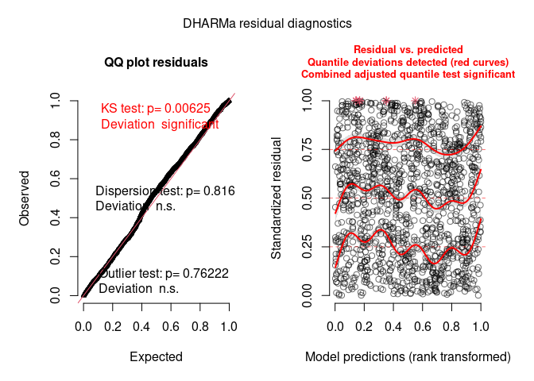
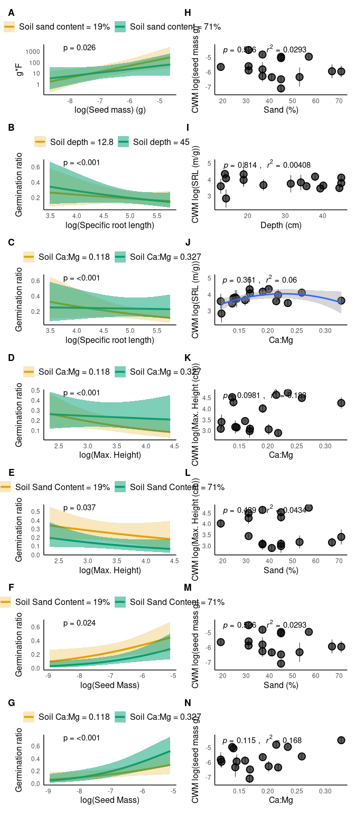

    requirements <- c('here', 'bbmle', 'broom', 'broom.mixed', 
                      'DHARMa', 'effects', 'factoextra', 'FactoMineR', 'TMB', 
                      'glmmTMB', 'latex2exp', 'patchwork', 
                      'tidyverse', 'visreg', 'devtools', 'performance', 'kableExtra')

    lapply(requirements,function(x){if(!require(x,character.only = T)){install.packages(x)}})

    # Install data package for cover data: 
    devtools::install_github("akleinhesselink/sedgwickcover")

    knitr::opts_chunk$set(echo = TRUE, warning = FALSE)
    knitr::opts_knit$set(root.dir = here::here())

## `R` Code to recreate all analyses in the manuscript

### Setup

    library(bbmle)
    library(broom)
    library(broom.mixed)
    library(DHARMa)
    library(effects)
    library(factoextra)
    library(FactoMineR)
    library(glmmTMB)
    library(latex2exp)
    library(patchwork)
    library(tidyverse)
    library(visreg)
    library(paran)
    library(sedgwickcover)

    theme_plots <- function() {
      theme_minimal() +
        theme(panel.border = element_blank(),
              panel.grid.major = element_blank(),
              panel.grid.minor = element_blank(),
              axis.line = element_line(colour = "black"),
              plot.tag = element_text(face = "bold"),
              axis.title = element_text(size = 12),
              plot.caption = element_text(size = 12)
        )
    }
    theme_set(theme_plots())

### Community-weighted trait means

Import trait and cover data

    strts_all <- read_csv("data/all_trait_data.csv") %>% 
      dplyr::select(-`...1`)

    ## Rows: 65 Columns: 15

    ## ── Column specification ───────────────────────────────────────────────────────────────────
    ## Delimiter: ","
    ## chr  (2): USDA_symbol, dataset
    ## dbl (13): ...1, leaf_size, SLA, LDMC, seed_mass, max_height, SRL, relative_spread, phen...

    ## 
    ## ℹ Use `spec()` to retrieve the full column specification for this data.
    ## ℹ Specify the column types or set `show_col_types = FALSE` to quiet this message.

    strts_all %>% 
      group_by(USDA_symbol) %>%
      summarize(n = n()) %>%
      arrange(-n)

    ## # A tibble: 57 × 2
    ##    USDA_symbol     n
    ##    <chr>       <int>
    ##  1 ANAR            2
    ##  2 BRMA3           2
    ##  3 CHGL            2
    ##  4 FEMI2           2
    ##  5 HOMU            2
    ##  6 MICA            2
    ##  7 MIDO            2
    ##  8 SIGA            2
    ##  9 ACMO2           1
    ## 10 AGHE2           1
    ## # … with 47 more rows

    # Remove some duplicate rows from the traits df
    # (These species were measured in multiple years;
    # retaining only those measurements made in 2017, i.e.
    # the year of the community cover sampling). 
    strts <- strts_all %>%
      group_by(USDA_symbol) %>%
      filter(!(USDA_symbol == "ANAR" & dataset == "TAPIOCA")) %>%
      filter(!(USDA_symbol == "BRMA3" & dataset == "2016")) %>%
      filter(!(USDA_symbol == "CHGL" & dataset == "2016")) %>%
      filter(!(USDA_symbol == "FEMI2" & dataset == "2016")) %>%
      filter(!(USDA_symbol == "HOMU" & dataset == "2016")) %>%
      filter(!(USDA_symbol == "MICA" & dataset == "2016")) %>%
      filter(!(USDA_symbol == "MIDO" & dataset == "TAPIOCA")) %>%
      filter(!(USDA_symbol == "SIGA" & dataset == "TAPIOCA")) %>%
      return


    # Import the cover data
    p17 <- read_csv("data/sedgwick_cover_2017.csv")

    ## Rows: 4400 Columns: 6

    ## ── Column specification ───────────────────────────────────────────────────────────────────
    ## Delimiter: ","
    ## chr (1): USDA_symbol
    ## dbl (5): year, site, plot, area, cover

    ## 
    ## ℹ Use `spec()` to retrieve the full column specification for this data.
    ## ℹ Specify the column types or set `show_col_types = FALSE` to quiet this message.

    # Calculate the relative cover in each plot at each site
    p17 <- p17 %>% 
      group_by(site, plot) %>%
      summarize(total_cover = sum(cover)) %>%
      left_join(p17, .) %>%
      mutate(relative_cover = cover/total_cover) %>% 
      as_tibble()

    ## `summarise()` has grouped output by 'site'. You can override using the `.groups` argument.

    ## Joining, by = c("site", "plot")

    # Merge the cover and trait data frames
    p17_trt <- left_join(p17, strts)

    ## Joining, by = "USDA_symbol"

    # species with missing data for at least one of the traits
    missing_trts <- 
      p17_trt %>%
      group_by(USDA_symbol, site, plot) %>%
      filter(is.na(SLA) | is.na(SRL) | is.na(max_height)| is.na(seed_mass)) %>%
      arrange(-relative_cover)

    missing_trts_nz <- missing_trts %>% filter(relative_cover > 0) 
    mean(missing_trts_nz$relative_cover)

    ## [1] 0.04041392

    # std error function
    sem <- function(x) (sd(x)/sqrt(n()))

    # Summarize the trait data to begin calculating CWM mean 
    # (and sd of CWM trait) at each site
    p17_trt_sum <- 
      p17_trt %>%
      mutate(lsla = (log(SLA)),
             lsrl = (log(SRL)),
             lmaxht = (log(max_height)),
             lseedmass = (log(seed_mass))) %>%
      dplyr::select(site:relative_cover, lsla, lsrl, lmaxht, lseedmass) %>%
      mutate(lsla_contrib = lsla*relative_cover,
             lsrl_contrib  = lsrl*relative_cover,
             lmaxht_contrib = lmaxht*relative_cover,
             lseedmass_contrib = lseedmass*relative_cover) %>% 
      group_by(site, plot) %>%
      summarize_at(c("lsla_contrib", "lsrl_contrib", "lmaxht_contrib", "lseedmass_contrib"), 
                   sum, na.rm = T) %>%
      rename(lsla_cwm = lsla_contrib, 
             lsrl_cwm = lsrl_contrib,
             lmaxht_cwm = lmaxht_contrib,
             lseedmass_cwm = lseedmass_contrib)

    # Summarize across the sub-plots at each site, to get the 
    # mean CWM, and SD+SEM at each site
    p17_sitesum <- 
      p17_trt_sum %>% 
      group_by(site) %>%
      summarize_at(c("lsla_cwm", "lsrl_cwm", "lmaxht_cwm", "lseedmass_cwm"), 
                   lst(mean, sd, sem))

    env <- read_csv("data/all_environmental_data.csv")

    ## Rows: 16 Columns: 22

    ## ── Column specification ───────────────────────────────────────────────────────────────────
    ## Delimiter: ","
    ## chr  (2): type, microsite
    ## dbl (20): plot, lat, lon, ele, Tmax, Tmin, organic_matter_ENR, pH, CEC_meq_100g, K_ppm,...

    ## 
    ## ℹ Use `spec()` to retrieve the full column specification for this data.
    ## ℹ Specify the column types or set `show_col_types = FALSE` to quiet this message.

    env$ca_mg <- env$Ca_ppm/env$Mg_ppm
    # merge in the environmental data with both plot-level and site-level CWM dfs
    p17_sitesum_env <- env %>% 
      rename(site = plot) %>%
      left_join(p17_sitesum, .)

    ## Joining, by = "site"

Now, compute CWM-environment relations:

    # Now, test for CWM trait shifts along the focal environmental axes ----
    # Import functions that run LMs and make plots
    source("functions/make_trait_env_lms.R")
    source("functions/make_trait_env_plot.R")
    lsla_sand_lm <- make_trait_env_lms(trait = "lsla_cwm_mean", env = "sand")
    lsla_sand_plot <- make_trait_env_plot(trait = "lsla_cwm_mean", env = "sand", 
                                          lsla_sand_lm, xl = "Sand (%)", yl = "CWM log(SLA (cm^2/g))")
    lsla_camg_lm <- make_trait_env_lms(trait = "lsla_cwm_mean", env = "ca_mg")
    lsla_camg_plot <- make_trait_env_plot(trait = "lsla_cwm_mean", env = "ca_mg", 
                                          lsla_camg_lm, xl = "Ca:Mg", yl = "CWM log(SLA (cm^2/g))")
    lsla_depth_lm <- make_trait_env_lms(trait = "lsla_cwm_mean", env = "depth")
    lsla_depth_plot <- make_trait_env_plot(trait = "lsla_cwm_mean", env = "depth", 
                                           lsla_depth_lm, xl = "Depth (cm)", yl = "CWM log(SLA (cm^2/g))")

    lsrl_sand_lm <- make_trait_env_lms(trait = "lsrl_cwm_mean", env = "sand")
    lsrl_sand_plot <- make_trait_env_plot(trait = "lsrl_cwm_mean", env = "sand", 
                                          lsrl_sand_lm, xl = "Sand (%)", yl = "CWM log(SRL (m/g))")
    lsrl_camg_lm <- make_trait_env_lms(trait = "lsrl_cwm_mean", env = "ca_mg")
    lsrl_camg_plot <- make_trait_env_plot(trait = "lsrl_cwm_mean", env = "ca_mg",
                                          lsrl_camg_lm, xl = "Ca:Mg", yl = "CWM log(SRL (m/g))")

    lsrl_depth_lm <- make_trait_env_lms(trait = "lsrl_cwm_mean", env = "depth")
    lsrl_depth_plot <- make_trait_env_plot(trait = "lsrl_cwm_mean", env = "depth", 
                                           lsrl_depth_lm, xl = "Depth (cm)", yl = "CWM log(SRL (m/g))")

    lmaxht_sand_lm <- make_trait_env_lms(trait = "lmaxht_cwm_mean", env = "sand")
    lmaxht_sand_plot <- make_trait_env_plot(trait = "lmaxht_cwm_mean", env = "sand", 
                                            lmaxht_sand_lm, xl = "Sand (%)", yl = "CWM log(Max. Height (cm))")
    lmaxht_camg_lm <- make_trait_env_lms(trait = "lmaxht_cwm_mean", env = "ca_mg")
    lmaxht_camg_plot <- make_trait_env_plot(trait = "lmaxht_cwm_mean", env = "ca_mg", 
                                            lmaxht_camg_lm, xl = "Ca:Mg", yl = "CWM log(Max. Height (cm))")
    lmaxht_depth_lm <- make_trait_env_lms(trait = "lmaxht_cwm_mean", env = "depth")
    lmaxht_depth_plot <- make_trait_env_plot(trait = "lmaxht_cwm_mean", env = "depth", 
                                             lmaxht_depth_lm, xl = "Depth (cm)", yl = "CWM log(Max. Height (cm))")

    lseedmass_sand_lm <- make_trait_env_lms(trait = "lseedmass_cwm_mean", env = "sand")
    lseedmass_sand_plot <- make_trait_env_plot(trait = "lseedmass_cwm_mean", env = "sand", 
                                               lseedmass_sand_lm, xl = "Sand (%)", yl = "CWM log(seed mass g)")
    lseedmass_camg_lm <- make_trait_env_lms(trait = "lseedmass_cwm_mean", env = "ca_mg")
    lseedmass_camg_plot <- make_trait_env_plot(trait = "lseedmass_cwm_mean", env = "ca_mg", 
                                               lseedmass_camg_lm, xl = "Ca:Mg", yl = "CWM log(seed mass g)")
    lseedmass_depth_lm <- make_trait_env_lms(trait = "lseedmass_cwm_mean", env = "depth")
    lseedmass_depth_plot <- make_trait_env_plot(trait = "lseedmass_cwm_mean", env = "depth", 
                                                lseedmass_depth_lm, xl = "Depth (cm)", yl = "CWM log(seed mass g)")

    cwmtrts_plot <- wrap_plots(list(lsla_sand_plot,  lsla_camg_plot, lsla_depth_plot,
                                    lsrl_sand_plot,  lsrl_camg_plot, lsrl_depth_plot, 
                                    lmaxht_sand_plot,lmaxht_camg_plot, lmaxht_depth_plot,
                                    lseedmass_sand_plot, lseedmass_camg_plot, lseedmass_depth_plot), 
                               nrow = 4)
    cwmtrts_plot


    cwmtrts_plot_seed <- wrap_plots(list(lseedmass_sand_plot, lseedmass_camg_plot, lseedmass_depth_plot), 
                                    nrow = 3)

There are five significant CWM trait-environment relationships:
SLA-Ca:Mg; SLA:Depth; SRL:Sand; Max. Height:Depth; Seed Mass:Depth

### Demography experiment

Import performance data, merge with trait data, and merge with
environmental variables data.

    ## Now, we can test for trait-environment interactions in the demography data ----

    # Clean/manage performance data ------
    performance <- read_csv("data/seed_production_processed_nocomp.csv")

    ## Rows: 1399 Columns: 5

    ## ── Column specification ───────────────────────────────────────────────────────────────────
    ## Delimiter: ","
    ## chr (2): plot_type, sp_code
    ## dbl (3): plot_num, replicate, num_seeds_produced

    ## 
    ## ℹ Use `spec()` to retrieve the full column specification for this data.
    ## ℹ Specify the column types or set `show_col_types = FALSE` to quiet this message.

    performance <- performance  %>% 
      # NA in this means the seed production was zero
      mutate(num_seeds_produced = ifelse(is.na(num_seeds_produced), 0,
                                         num_seeds_produced))
    germination_data <- read_csv("data/germination_data.csv") %>%
      rename(replicate = rep)

    ## Rows: 1360 Columns: 6

    ## ── Column specification ───────────────────────────────────────────────────────────────────
    ## Delimiter: ","
    ## chr (1): sp_code
    ## dbl (5): plot_num, rep, num_germinants, expected_germinants_l, num_germinants_corrected

    ## 
    ## ℹ Use `spec()` to retrieve the full column specification for this data.
    ## ℹ Specify the column types or set `show_col_types = FALSE` to quiet this message.

    performance <- left_join(performance, germination_data) 

    ## Joining, by = c("plot_num", "replicate", "sp_code")

    performance <- performance %>% 
      # Make a new column for Hummock or matrix
      mutate(plot_env = ifelse(plot_num %in% c(742:745,747,748,750,751,752,755),
                               "hummock", "matrix")) %>%
      return


    # Make a new df to help match species names between trait and performance dfs
    sp_code_usda_symbol <- data.frame(
      sp_code = unique(performance$sp_code), 
      USDA_symbol = c("URLI5", "AMME", "BRMA3", "CEME2",
                      "CLBO", "CLPU2", "CHGL", "EUSP",   
                      "HECO7", "HOMU", "LACA7", "LOWR2", 
                      "MEPO3", "MICA", "PLER3", "SACO6", "FEMI2")
    )

    performance <- left_join(performance, sp_code_usda_symbol)

    ## Joining, by = "sp_code"

    # Add in the environmental data
    perf_env <- left_join(performance,
                          env %>%
                            # keep only the focal environmental variables, for now
                            dplyr::select(plot_num = plot, unscaled_ca_mg = ca_mg, 
                                          unscaled_sand = sand, unscaled_depth = depth))

    ## Joining, by = "plot_num"

    perf_env

    ## # A tibble: 1,399 × 13
    ##    plot_num plot_type replicate sp_code num_seeds_produced num_germinants expected_germina…
    ##       <dbl> <chr>         <dbl> <chr>                <dbl>          <dbl>             <dbl>
    ##  1      740 L                 1 AGHE                   768             29                60
    ##  2      740 L                 2 AGHE                  1206             35                60
    ##  3      740 L                 3 AGHE                  1425             26                60
    ##  4      740 L                 4 AGHE                  1864             33                60
    ##  5      740 L                 5 AGHE                  1425             21                60
    ##  6      740 L                 6 AGHE                   987             NA                NA
    ##  7      741 L                 1 AGHE                  1206             25                60
    ##  8      741 L                 2 AGHE                   987             19                60
    ##  9      741 L                 3 AGHE                   548             31                60
    ## 10      741 L                 4 AGHE                  1206             26                60
    ## # … with 1,389 more rows, and 6 more variables: num_germinants_corrected <dbl>,
    ## #   plot_env <chr>, USDA_symbol <chr>, unscaled_ca_mg <dbl>, unscaled_sand <dbl>,
    ## #   unscaled_depth <dbl>

    # Add in the trait data

    # Include only the trait data collected in 2016 or for TAPIOCA
    trait_df16 <- 
      strts_all %>% 
      filter(dataset %in% c("TAPIOCA", "2016")) %>%
      dplyr::select(USDA_symbol, SLA, SRL, max_height, seed_mass)
    # We only have seed mass from other years for BRMA and HOMU, so import those in.
    trait_df16[which(trait_df16$USDA_symbol == "HOMU"), "seed_mass"] <- 
      strts_all[which(strts_all$USDA_symbol == "HOMU"), "seed_mass"] %>% unlist %>% .[1]
    trait_df16[which(trait_df16$USDA_symbol == "BRMA3"), "seed_mass"] <- 
      strts_all[which(strts_all$USDA_symbol == "BRMA3"), "seed_mass"] %>% unlist %>% .[1]


    perf_env_trt <- left_join(perf_env, trait_df16, by = "USDA_symbol")

    perf_env_trt$unscaled_log_sla <- log(perf_env_trt$SLA)
    perf_env_trt$unscaled_log_srl <- log(perf_env_trt$SRL)
    perf_env_trt$unscaled_log_maxht <- log(perf_env_trt$max_height)
    perf_env_trt$unscaled_log_seedmass <- log(perf_env_trt$seed_mass)

    # perf_env_trt <- left_join(perf_env, traits) 
    perf_env_trt$plot_num <- as.factor(perf_env_trt$plot_num)
    perf_env_trt$num_seeds_produced <- as.integer(perf_env_trt$num_seeds_produced)

Now, run the trait-environment GLMMs

    # Trait-Env model based on CWM trait  ----
    # SLA-Ca:Mg; SLA:Depth; SRL:Sand; Max. Height:Depth

    # scale the relevant columns
    perf_env_trt <- perf_env_trt %>% mutate(
      ca_mg = scale(unscaled_ca_mg), 
      depth = scale(unscaled_depth), 
      sand = scale(unscaled_sand),
      log_sla = scale(unscaled_log_sla), 
      log_srl = scale(unscaled_log_srl),
      log_maxht = scale(unscaled_log_maxht),
      log_seedmass = scale(unscaled_log_seedmass),
      germ_ratio = num_germinants_corrected/expected_germinants_l,
      germ_prod = floor(num_seeds_produced*germ_ratio))

    trait_model_full <- glmmTMB(num_seeds_produced ~ 
                                  ca_mg* log_sla +
                                  depth*log_sla +
                                  sand*log_sla +
                                  ca_mg*log_srl +
                                  depth*log_srl +
                                  sand*log_srl +
                                  ca_mg*log_maxht + 
                                  sand*log_maxht +
                                  depth*log_maxht +
                                  ca_mg*log_seedmass +
                                  sand*log_seedmass +
                                  depth*log_seedmass +
                                  (1|sp_code) + (1|plot_num),
                                ziformula = ~1,
                                data = perf_env_trt,
                                family = nbinom2(link = "log"))
    summary(trait_model_full)

    ##  Family: nbinom2  ( log )
    ## Formula:          num_seeds_produced ~ ca_mg * log_sla + depth * log_sla + sand *  
    ##     log_sla + ca_mg * log_srl + depth * log_srl + sand * log_srl +  
    ##     ca_mg * log_maxht + sand * log_maxht + depth * log_maxht +  
    ##     ca_mg * log_seedmass + sand * log_seedmass + depth * log_seedmass +  
    ##     (1 | sp_code) + (1 | plot_num)
    ## Zero inflation:                      ~1
    ## Data: perf_env_trt
    ## 
    ##      AIC      BIC   logLik deviance df.resid 
    ##  13246.9  13372.7  -6599.4  13198.9     1375 
    ## 
    ## Random effects:
    ## 
    ## Conditional model:
    ##  Groups   Name        Variance Std.Dev.
    ##  sp_code  (Intercept) 0.4506   0.6713  
    ##  plot_num (Intercept) 0.2353   0.4851  
    ## Number of obs: 1399, groups:  sp_code, 17; plot_num, 16
    ## 
    ## Dispersion parameter for nbinom2 family (): 1.54 
    ## 
    ## Conditional model:
    ##                    Estimate Std. Error z value Pr(>|z|)    
    ## (Intercept)         5.27057    0.20738  25.415  < 2e-16 ***
    ## ca_mg               0.36426    0.15086   2.415 0.015756 *  
    ## log_sla            -0.18257    0.17028  -1.072 0.283640    
    ## depth               0.32482    0.13719   2.368 0.017902 *  
    ## sand               -0.02416    0.13867  -0.174 0.861676    
    ## log_srl             0.06550    0.18259   0.359 0.719806    
    ## log_maxht           0.61972    0.18198   3.405 0.000661 ***
    ## log_seedmass        0.22919    0.17385   1.318 0.187384    
    ## ca_mg:log_sla       0.13332    0.03418   3.901  9.6e-05 ***
    ## log_sla:depth      -0.02694    0.02942  -0.915 0.359941    
    ## log_sla:sand        0.04451    0.03097   1.437 0.150592    
    ## ca_mg:log_srl      -0.03663    0.04256  -0.861 0.389354    
    ## depth:log_srl      -0.01212    0.03705  -0.327 0.743616    
    ## sand:log_srl       -0.11098    0.03474  -3.195 0.001399 ** 
    ## ca_mg:log_maxht    -0.04342    0.04026  -1.079 0.280739    
    ## sand:log_maxht      0.05861    0.03865   1.516 0.129429    
    ## depth:log_maxht     0.05954    0.04137   1.439 0.150109    
    ## ca_mg:log_seedmass  0.07007    0.04136   1.694 0.090263 .  
    ## sand:log_seedmass   0.01030    0.03517   0.293 0.769630    
    ## depth:log_seedmass  0.08618    0.03603   2.392 0.016750 *  
    ## ---
    ## Signif. codes:  0 '***' 0.001 '**' 0.01 '*' 0.05 '.' 0.1 ' ' 1
    ## 
    ## Zero-inflation model:
    ##             Estimate Std. Error z value Pr(>|z|)    
    ## (Intercept) -0.53232    0.05571  -9.556   <2e-16 ***
    ## ---
    ## Signif. codes:  0 '***' 0.001 '**' 0.01 '*' 0.05 '.' 0.1 ' ' 1

    trait_model_null <- glmmTMB(num_seeds_produced ~ 
                                  1 +
                                  (1|sp_code) + (1|plot_num),
                                ziformula = ~1,
                                data = perf_env_trt,
                                family = nbinom2(link = "log"))


    trait_model_additive <- glmmTMB(num_seeds_produced ~ 
                                      ca_mg + sand + depth + 
                                      log_sla + log_srl + log_maxht + log_seedmass + 
                                      (1|sp_code) + (1|plot_num),
                                    ziformula = ~1,
                                    data = perf_env_trt,
                                    family = nbinom2(link = "log"))

Check model performance:

    # Verify whether interaction terms are supported
    # relative to a model with only additive terms
    # and a null model
    bbmle::AICctab(trait_model_null, trait_model_full, trait_model_additive)

    ##                      dAICc df
    ## trait_model_full      0.0  24
    ## trait_model_additive 21.7  12
    ## trait_model_null     30.9  5

    # Check VIF in the conditional component of the full model
    performance::check_collinearity(trait_model_full, component = "conditional")

    ## # Check for Multicollinearity
    ## 
    ## Low Correlation
    ## 
    ##                Term  VIF Increased SE Tolerance
    ##               ca_mg 1.46         1.21      0.68
    ##             log_sla 1.05         1.02      0.95
    ##               depth 1.21         1.10      0.83
    ##                sand 1.25         1.12      0.80
    ##             log_srl 1.21         1.10      0.83
    ##           log_maxht 1.19         1.09      0.84
    ##        log_seedmass 1.09         1.04      0.92
    ##       ca_mg:log_sla 1.33         1.15      0.75
    ##       log_sla:depth 1.20         1.10      0.83
    ##        log_sla:sand 1.24         1.11      0.81
    ##       ca_mg:log_srl 1.66         1.29      0.60
    ##       depth:log_srl 1.68         1.30      0.60
    ##        sand:log_srl 1.53         1.24      0.66
    ##     ca_mg:log_maxht 1.74         1.32      0.58
    ##      sand:log_maxht 1.54         1.24      0.65
    ##     depth:log_maxht 1.71         1.31      0.58
    ##  ca_mg:log_seedmass 1.59         1.26      0.63
    ##   sand:log_seedmass 1.21         1.10      0.83
    ##  depth:log_seedmass 1.49         1.22      0.67

    # Check other model diagnostics using DHARMa
    resids <- DHARMa::simulateResiduals(trait_model_full)
    plot(resids)



    # Looks some issue with uniformity - though the QQ looks fairly
    # linear, and Florian Hartig's notes (e.g. https://github.com/florianhartig/DHARMa/issues/181)
    # suggest that significance of Kolmogorov-Smirnov test need not be an 
    # issue with large numbers of samples.

Repeat the steps above, but for germination ratio as the demographic
response variable

    germ_trait_model_full <- glmmTMB(germ_ratio ~ 
                                       ca_mg* log_sla +
                                       depth*log_sla +
                                       sand*log_sla +
                                       ca_mg*log_srl +
                                       depth*log_srl +
                                       sand*log_srl +
                                       ca_mg*log_maxht +
                                       sand*log_maxht +
                                       depth*log_maxht +
                                       ca_mg*log_seedmass +
                                       sand*log_seedmass +
                                       depth*log_seedmass +
                                       (1|sp_code) + (1|plot_num),
                                     ziformula = ~1,
                                     weights = expected_germinants_l,
                                     data = perf_env_trt,
                                     family = binomial)
    summary(germ_trait_model_full)

    ##  Family: binomial  ( logit )
    ## Formula:          germ_ratio ~ ca_mg * log_sla + depth * log_sla + sand * log_sla +  
    ##     ca_mg * log_srl + depth * log_srl + sand * log_srl + ca_mg *  
    ##     log_maxht + sand * log_maxht + depth * log_maxht + ca_mg *  
    ##     log_seedmass + sand * log_seedmass + depth * log_seedmass +  
    ##     (1 | sp_code) + (1 | plot_num)
    ## Zero inflation:              ~1
    ## Data: perf_env_trt
    ## Weights: expected_germinants_l
    ## 
    ##      AIC      BIC   logLik deviance df.resid 
    ##  15329.4  15449.3  -7641.7  15283.4     1337 
    ## 
    ## Random effects:
    ## 
    ## Conditional model:
    ##  Groups   Name        Variance Std.Dev.
    ##  sp_code  (Intercept) 0.93011  0.9644  
    ##  plot_num (Intercept) 0.09286  0.3047  
    ## Number of obs: 1360, groups:  sp_code, 17; plot_num, 16
    ## 
    ## Conditional model:
    ##                     Estimate Std. Error z value Pr(>|z|)    
    ## (Intercept)        -1.436585   0.246548  -5.827 5.65e-09 ***
    ## ca_mg               0.111468   0.092632   1.203  0.22885    
    ## log_sla            -0.291001   0.240677  -1.209  0.22663    
    ## depth               0.019931   0.084204   0.237  0.81289    
    ## sand               -0.228518   0.085386  -2.676  0.00744 ** 
    ## log_srl            -0.252324   0.256297  -0.984  0.32487    
    ## log_maxht          -0.316444   0.252178  -1.255  0.20954    
    ## log_seedmass        0.578586   0.241472   2.396  0.01657 *  
    ## ca_mg:log_sla       0.047782   0.010864   4.398 1.09e-05 ***
    ## log_sla:depth      -0.013834   0.010175  -1.360  0.17395    
    ## log_sla:sand        0.008868   0.011166   0.794  0.42707    
    ## ca_mg:log_srl       0.082938   0.011100   7.472 7.91e-14 ***
    ## depth:log_srl      -0.046089   0.010374  -4.443 8.87e-06 ***
    ## sand:log_srl       -0.011107   0.011102  -1.000  0.31710    
    ## ca_mg:log_maxht     0.086169   0.013022   6.617 3.67e-11 ***
    ## sand:log_maxht     -0.029945   0.014394  -2.080  0.03749 *  
    ## depth:log_maxht    -0.062612   0.012562  -4.984 6.22e-07 ***
    ## ca_mg:log_seedmass  0.084725   0.012397   6.834 8.26e-12 ***
    ## sand:log_seedmass   0.029958   0.013294   2.253  0.02423 *  
    ## depth:log_seedmass -0.016727   0.011571  -1.446  0.14829    
    ## ---
    ## Signif. codes:  0 '***' 0.001 '**' 0.01 '*' 0.05 '.' 0.1 ' ' 1
    ## 
    ## Zero-inflation model:
    ##             Estimate Std. Error z value Pr(>|z|)    
    ## (Intercept)  -2.0817     0.1021   -20.4   <2e-16 ***
    ## ---
    ## Signif. codes:  0 '***' 0.001 '**' 0.01 '*' 0.05 '.' 0.1 ' ' 1

    germ_trait_model_null <- glmmTMB(germ_ratio ~ 
                                       1 +
                                       (1|sp_code) + (1|plot_num),
                                     ziformula = ~1,
                                     data = perf_env_trt,
                                     weights = expected_germinants_l,
                                     family = binomial)


    germ_trait_model_additive <- glmmTMB(germ_ratio ~ 
                                           ca_mg + sand + depth + 
                                           log_sla + log_srl + log_maxht + log_seedmass + 
                                           (1|sp_code) + (1|plot_num),
                                         ziformula = ~1,
                                         weights = expected_germinants_l,
                                         data = perf_env_trt,
                                         family = binomial)

    bbmle::AICctab(germ_trait_model_full, germ_trait_model_null, germ_trait_model_additive)

    ##                           dAICc df
    ## germ_trait_model_full       0.0 23
    ## germ_trait_model_additive 397.8 11
    ## germ_trait_model_null     401.7 4

    resids <- DHARMa::simulateResiduals(germ_trait_model_full)
    plot(resids)

    ## DHARMa:testOutliers with type = binomial may have inflated Type I error rates for integer-valued distributions. To get a more exact result, it is recommended to re-run testOutliers with type = 'bootstrap'. See ?testOutliers for details


    # Looks some issue with uniformity - though the QQ looks fairly
    # linear, and Florian Hartig's notes (e.g. https://github.com/florianhartig/DHARMa/issues/181)
    # suggest that significance of Kolmogorov-Smirnov test need not be an 
    # issue with large numbers of samples.

Analysis of Germ\*Seed\_production

    germprod_trait_model_full <- glmmTMB(germ_prod ~ 
                                           ca_mg* log_sla +
                                           depth*log_sla +
                                           sand*log_sla +
                                           ca_mg*log_srl +
                                           depth*log_srl +
                                           sand*log_srl +
                                           ca_mg*log_maxht + 
                                           sand*log_maxht +
                                           depth*log_maxht +
                                           ca_mg*log_seedmass +
                                           sand*log_seedmass +
                                           depth*log_seedmass +
                                           (1|sp_code) + (1|plot_num),
                                         ziformula = ~1,
                                         data = perf_env_trt,
                                         family = nbinom2(link = "log"))
    summary(germprod_trait_model_full)

    ##  Family: nbinom2  ( log )
    ## Formula:          germ_prod ~ ca_mg * log_sla + depth * log_sla + sand * log_sla +  
    ##     ca_mg * log_srl + depth * log_srl + sand * log_srl + ca_mg *  
    ##     log_maxht + sand * log_maxht + depth * log_maxht + ca_mg *  
    ##     log_seedmass + sand * log_seedmass + depth * log_seedmass +  
    ##     (1 | sp_code) + (1 | plot_num)
    ## Zero inflation:             ~1
    ## Data: perf_env_trt
    ## 
    ##      AIC      BIC   logLik deviance df.resid 
    ##   9788.4   9913.5  -4870.2   9740.4     1336 
    ## 
    ## Random effects:
    ## 
    ## Conditional model:
    ##  Groups   Name        Variance Std.Dev.
    ##  sp_code  (Intercept) 3.5032   1.8717  
    ##  plot_num (Intercept) 0.5117   0.7153  
    ## Number of obs: 1360, groups:  sp_code, 17; plot_num, 16
    ## 
    ## Dispersion parameter for nbinom2 family (): 0.699 
    ## 
    ## Conditional model:
    ##                     Estimate Std. Error z value Pr(>|z|)    
    ## (Intercept)         2.951120   0.491284   6.007 1.89e-09 ***
    ## ca_mg               0.698442   0.223851   3.120  0.00181 ** 
    ## log_sla            -0.607563   0.468589  -1.297  0.19478    
    ## depth               0.351933   0.201849   1.744  0.08124 .  
    ## sand               -0.101619   0.204659  -0.497  0.61952    
    ## log_srl            -0.111318   0.499155  -0.223  0.82353    
    ## log_maxht           0.158034   0.492304   0.321  0.74820    
    ## log_seedmass        1.019855   0.470353   2.168  0.03014 *  
    ## ca_mg:log_sla       0.256983   0.053085   4.841 1.29e-06 ***
    ## log_sla:depth      -0.005919   0.042368  -0.140  0.88889    
    ## log_sla:sand        0.054600   0.048987   1.115  0.26503    
    ## ca_mg:log_srl       0.098004   0.066579   1.472  0.14102    
    ## depth:log_srl      -0.040143   0.053394  -0.752  0.45215    
    ## sand:log_srl       -0.118087   0.054105  -2.183  0.02907 *  
    ## ca_mg:log_maxht     0.052355   0.062661   0.836  0.40342    
    ## sand:log_maxht      0.089636   0.058791   1.525  0.12734    
    ## depth:log_maxht     0.034176   0.057026   0.599  0.54897    
    ## ca_mg:log_seedmass -0.110793   0.061638  -1.797  0.07226 .  
    ## sand:log_seedmass  -0.136593   0.061481  -2.222  0.02630 *  
    ## depth:log_seedmass  0.033622   0.052208   0.644  0.51958    
    ## ---
    ## Signif. codes:  0 '***' 0.001 '**' 0.01 '*' 0.05 '.' 0.1 ' ' 1
    ## 
    ## Zero-inflation model:
    ##             Estimate Std. Error z value Pr(>|z|)    
    ## (Intercept)  -1.1965     0.1096  -10.92   <2e-16 ***
    ## ---
    ## Signif. codes:  0 '***' 0.001 '**' 0.01 '*' 0.05 '.' 0.1 ' ' 1

    germprod_trait_model_null <- glmmTMB(germ_prod ~ 
                                           1 +
                                           (1|sp_code) + (1|plot_num),
                                         ziformula = ~1,
                                         data = perf_env_trt,
                                         family = nbinom2(link = "log"))


    germprod_trait_model_additive <- glmmTMB(germ_prod ~ 
                                               ca_mg + sand + depth + 
                                               log_sla + log_srl + log_maxht + log_seedmass + 
                                               (1|sp_code) + (1|plot_num),
                                             ziformula = ~1,
                                             data = perf_env_trt,
                                             family = nbinom2(link = "log"))
    bbmle::AICctab(germprod_trait_model_null, germprod_trait_model_full, germprod_trait_model_additive)

    ##                               dAICc df
    ## germprod_trait_model_full      0.0  24
    ## germprod_trait_model_additive 29.3  12
    ## germprod_trait_model_null     36.1  5

    # Check VIF in the conditional component of the full model
    performance::check_collinearity(germprod_trait_model_full, component = "conditional")

    ## # Check for Multicollinearity
    ## 
    ## Low Correlation
    ## 
    ##                Term  VIF Increased SE Tolerance
    ##               ca_mg 1.47         1.21      0.68
    ##             log_sla 1.05         1.02      0.95
    ##               depth 1.20         1.10      0.83
    ##                sand 1.25         1.12      0.80
    ##             log_srl 1.21         1.10      0.83
    ##           log_maxht 1.18         1.08      0.85
    ##        log_seedmass 1.08         1.04      0.93
    ##       ca_mg:log_sla 1.39         1.18      0.72
    ##       log_sla:depth 1.16         1.08      0.86
    ##        log_sla:sand 1.41         1.19      0.71
    ##       ca_mg:log_srl 1.79         1.34      0.56
    ##       depth:log_srl 1.60         1.26      0.62
    ##        sand:log_srl 1.84         1.36      0.54
    ##     ca_mg:log_maxht 1.72         1.31      0.58
    ##      sand:log_maxht 1.68         1.30      0.60
    ##     depth:log_maxht 1.64         1.28      0.61
    ##  ca_mg:log_seedmass 1.72         1.31      0.58
    ##   sand:log_seedmass 1.41         1.19      0.71
    ##  depth:log_seedmass 1.42         1.19      0.71

    # Check other model diagnostics using DHARMa
    resids <- DHARMa::simulateResiduals(germprod_trait_model_full)
    plot(resids)


Now, make plots

    ## plot model coefficients ##
    model_terms_full <- 
      data.frame(confint(trait_model_full)) %>%
      rownames_to_column() %>%
      rename(term = rowname, lower_bound = X2.5..,
             upper_bound = X97.5.., estimate = Estimate) %>%
      filter(str_detect(string = term, pattern  = "cond.")) %>%
      filter(!str_detect(string = term, pattern  = "Intercept")) %>%
      mutate(term = str_replace(term, "cond.", ""),
             order = c(19,16,18,17,15:6,4,5,3,1,2)) %>%
      arrange(order) %>%
      mutate(term_clean = rev(c("Soil Ca:Mg", "Soil depth", "Sand content", 
                                "Specific leaf area (SLA)", "Specific root length (SRL)", "Max height", "Seed mass",
                                "Ca:Mg x SLA", "Depth x SLA", "Sand content x SLA",
                                "Ca:Mg x SRL", "Depth x SRL", "Sand content x SRL",
                                "Ca:Mg x Max height", "Depth x Max height", "Sand content x Max height",
                                "Ca:Mg x Seed mass", "Depth x Seed mass", "Sand content x Seed mass"))) %>%
      arrange(-order) %>%
      mutate(term_clean = fct_reorder(term_clean, -order),
             fill_color = ifelse(upper_bound > 0 & lower_bound < 0, "NS", "S"))


    germ_model_terms_full <- 
      data.frame(confint(germ_trait_model_full)) %>%
      rownames_to_column() %>%
      rename(term = rowname, lower_bound = X2.5..,
             upper_bound = X97.5.., estimate = Estimate) %>%
      filter(str_detect(string = term, pattern  = "cond.")) %>%
      filter(!str_detect(string = term, pattern  = "Intercept")) %>%
      mutate(term = str_replace(term, "cond.", ""),
             order = c(19,16,18,17,15:6,4,5,3,1,2)) %>%
      arrange(order) %>%
      mutate(term_clean = rev(c("Soil Ca:Mg", "Soil depth", "Sand content", 
                                "Specific leaf area (SLA)", "Specific root length (SRL)", "Max height", "Seed mass",
                                "Ca:Mg x SLA", "Depth x SLA", "Sand content x SLA",
                                "Ca:Mg x SRL", "Depth x SRL", "Sand content x SRL",
                                "Ca:Mg x Max height", "Depth x Max height", "Sand content x Max height",
                                "Ca:Mg x Seed mass", "Depth x Seed mass", "Sand content x Seed mass"))) %>%
      arrange(-order) %>%
      mutate(term_clean = fct_reorder(term_clean, -order),
             fill_color = ifelse(upper_bound > 0 & lower_bound < 0, "NS", "S"))


    germprod_model_terms_full <- 
      data.frame(confint(germprod_trait_model_full)) %>%
      rownames_to_column() %>%
      rename(term = rowname, lower_bound = X2.5..,
             upper_bound = X97.5.., estimate = Estimate) %>%
      filter(str_detect(string = term, pattern  = "cond.")) %>%
      filter(!str_detect(string = term, pattern  = "Intercept")) %>%
      mutate(term = str_replace(term, "cond.", ""),
             order = c(19,16,18,17,15:6,4,5,3,1,2)) %>%
      arrange(order) %>%
      mutate(term_clean = rev(c("Soil Ca:Mg", "Soil depth", "Sand content", 
                                "Specific leaf area (SLA)", "Specific root length (SRL)", "Max height", "Seed mass",
                                "Ca:Mg x SLA", "Depth x SLA", "Sand content x SLA",
                                "Ca:Mg x SRL", "Depth x SRL", "Sand content x SRL",
                                "Ca:Mg x Max height", "Depth x Max height", "Sand content x Max height",
                                "Ca:Mg x Seed mass", "Depth x Seed mass", "Sand content x Seed mass"))) %>%
      arrange(order) %>%
      mutate(term_clean = fct_reorder(term_clean, -order),
             fill_color = ifelse(upper_bound > 0 & lower_bound < 0, "NS", "S"))

Make Figure 2

    ## Compute the conditional and marginal R2
    rsq_germprod <- performance::r2_nakagawa(germprod_trait_model_full)
    rsq_prod <- performance::r2_nakagawa(trait_model_full)
    rsq_germ <- performance::r2_nakagawa(germ_trait_model_full)

    # Combine the model coefs dfs
    combined_model_coefs <- left_join(model_terms_full, 
                                      germ_model_terms_full, by = c("term", "term_clean", "order"), )

    all_combined_model_coefs <- left_join(combined_model_coefs, germprod_model_terms_full, 
                                          by = c("term", "term_clean", "order"), suffix = c("1","2"))

    # Make the plot
    (all_combined_model_coefs_plot <- 
        ggplot(all_combined_model_coefs) + 
        geom_errorbar(aes(x = order, ymin = lower_bound.x,
                          ymax = upper_bound.x),  color = alpha("grey", 0)) + 
        geom_vline(xintercept = c(2,5,11,12), size = 8, color = alpha("#0072B2", 0.5)) +
        geom_vline(xintercept = c(7), size = 8, color = alpha("#D55E00", 0.25)) +
        
        # Germination ratio
        geom_point(aes(x = order, y = estimate.y, fill = fill_color.y),
                   size = 2.35, shape = 21, stroke = 1.5) +
        geom_errorbar(aes(x = order, ymin = lower_bound.y,
                          ymax = upper_bound.y), width = 0) + 
        geom_hline(yintercept = 1.5) + 
        
        # Seed production
        geom_point(aes(x = order, y = estimate.x + 3, fill = fill_color.x),
                   size = 2.35, shape = 21, stroke = 1.5) +
        geom_errorbar(aes(x = order, ymin = lower_bound.x + 3,
                          ymax = upper_bound.x + 3), width = 0) + 
        geom_hline(yintercept = c(0,3,6), linetype = "dashed") + 
        geom_hline(yintercept = 4.45) + 
        
        # Seed production x Germination ratio
        geom_point(aes(x = order, y = estimate + 6, fill = fill_color),
                   size = 2.35, shape = 21, stroke = 1.5) +
        geom_errorbar(aes(x = order, ymin = lower_bound + 6,
                          ymax = upper_bound + 6), width = 0) + 
        geom_hline(yintercept = 0, linetype = "dashed") + 
        
        
        scale_y_continuous(breaks = c(-1, 0, 1, 2, 3, 4, 5, 6,7,8), 
                           labels = c("-1", 
                                      paste0("0\n\n Marginal R2 = ",round(rsq_germ$R2_marginal,3),
                                             "\nConditional R2 = ",round(rsq_germ$R2_conditional,3)), "1",
                                      "-1",paste0("0\n\n Marginal R2 = ",round(rsq_prod$R2_marginal,3),
                                                  "\nConditional R2 = ",round(rsq_prod$R2_conditional,3)),"1",
                                      "-1",paste0("0\n\n Marginal R2 = ",round(rsq_germprod$R2_marginal,3),
                                                  "\nConditional R2 = ",round(rsq_germprod$R2_conditional,3)),"1","2"
                           ),
                           sec.axis = dup_axis(breaks = c(0, 3, 6), 
                                               labels = c("(A) Germination rate (g)\n", 
                                                          "(B) Fecundity (F)\n",
                                                          "(C) g*F\n"), 
                                               name = "")) +
        
        scale_x_continuous(breaks = combined_model_coefs$order, labels =combined_model_coefs$term_clean, expand = c(0,0)) +
        scale_fill_manual(values = c("white", "grey60")) + 
        xlab("") +
        ylab("") +
        
        theme(axis.text = element_text(color = "black", size = 11),
              axis.title = element_text(size = 12), 
              # axis.line.x.top  = element_line(size = 0),
              axis.text.x.top = element_text(face = "bold"),
              axis.line.x.top = element_blank(),
              legend.position = "NA") +
        coord_flip()
      
    )


    # ggsave("figures/all-combined-model-coefficients.pdf", all_combined_model_coefs_plot, height = 7, width = 8)

    ## Interaction plots ##

    colpal <- c( "#E69F00", "#009E73")

    get_pval <- function(model_out, mod_term) {
      pval <- model_out %>% broom.mixed::tidy() %>% 
        filter(term == mod_term) %>% 
        dplyr::select(p.value) %>% unlist
      
      pval <- ifelse(pval < .05, 
                     paste0("\t p = ", scales::pvalue(pval)),
                     "\t N.S.")
      pval
    }

    # make variables to help un-scale the axes
    sla_sd <- sd(perf_env_trt$unscaled_log_sla)
    sla_mean <- mean(perf_env_trt$unscaled_log_sla)
    srl_sd <- sd(perf_env_trt$unscaled_log_srl)
    srl_mean <- mean(perf_env_trt$unscaled_log_srl)
    maxht_sd <- sd(perf_env_trt$unscaled_log_maxht)
    maxht_mean <- mean(perf_env_trt$unscaled_log_maxht)
    seedmass_sd <- sd(perf_env_trt$unscaled_log_seedmass)
    seedmass_mean <- mean(perf_env_trt$unscaled_log_seedmass)

    ca_mg_min <- round(min(perf_env_trt$unscaled_ca_mg), 3)
    ca_mg_max <- round(max(perf_env_trt$unscaled_ca_mg), 3)
    sand_min  <- round(min(perf_env_trt$unscaled_sand), 3)
    sand_max  <- round(max(perf_env_trt$unscaled_sand), 3)
    depth_min <- round(min(perf_env_trt$unscaled_depth), 3)
    depth_max <- round(max(perf_env_trt$unscaled_depth), 3)

    # FECUNDITY ONLY --------
    # SLA:CA_MG
    eff_sla_camg_df <- effects::effect("ca_mg:log_sla", trait_model_full, 
                                       xlevels = list(ca_mg = c(min(perf_env_trt$ca_mg),
                                                                max(perf_env_trt$ca_mg)),
                                                      log_sla = c(min(perf_env_trt$log_sla),
                                                                  max(perf_env_trt$log_sla)))) %>%
      data.frame
    # The warning message can be ignored according to Ben Bolker in the GLMMTMB docs:
    # https://github.com/glmmTMB/glmmTMB/blob/master/glmmTMB/inst/doc/model_evaluation.pdf
    plot_sla_camg <- 
      ggplot(eff_sla_camg_df, aes(x = (log_sla*sla_sd)+sla_mean, y = fit, color=factor(ca_mg)))+
      geom_line(size=1.25)+
      geom_ribbon(aes(ymin=lower,ymax=upper, fill=factor(ca_mg), alpha=factor(ca_mg)),
                  colour= NA) +
      annotate("text", x = -Inf, y = Inf, hjust = 0, vjust = 1, 
               label = get_pval(mod_term = "ca_mg:log_sla", model_out = trait_model_full)) +
      scale_fill_manual(name = "", 
                        labels = c(paste0("Soil Ca:Mg = ", ca_mg_min), 
                                   paste0("Soil Ca:Mg = ", ca_mg_max)),
                        values = colpal) +
      scale_color_manual(name = "", 
                         labels = c(paste0("Soil Ca:Mg = ", ca_mg_min), 
                                    paste0("Soil Ca:Mg = ", ca_mg_max)),
                         values = colpal) +
      scale_alpha_manual(name = "", 
                         labels = c(paste0("Soil Ca:Mg = ", ca_mg_min), 
                                    paste0("Soil Ca:Mg = ", ca_mg_max)),
                         values = c(0.25,0.5)) +
      
      scale_y_log10() +
      xlab("log(Specific leaf area)") + 
      ylab("Fecundity") + 
      theme(legend.position = "top",
            legend.text = element_text(size = 12))


    eff_sla_depth_df <- effects::effect("log_sla:depth", trait_model_full,
                                        xlevels = list(depth = c(min(perf_env_trt$depth),
                                                                 max(perf_env_trt$depth)),
                                                       log_sla = c(min(perf_env_trt$log_sla),
                                                                   max(perf_env_trt$log_sla)))) %>%
      data.frame

    plot_sla_depth <- 
      ggplot(eff_sla_depth_df, aes(x = (log_sla*sla_sd)+sla_mean, y = fit, color=factor(depth)))+
      geom_line(size=1.25)+
      geom_ribbon(aes(ymin=lower, ymax=upper,fill=factor(depth), alpha=factor(depth)),
                  colour= NA) +
      annotate("text", x = -Inf, y = Inf, hjust = 0, vjust = 1, 
               label = get_pval(mod_term = "log_sla:depth", model_out = trait_model_full)) +
      
      scale_fill_manual(name = "",
                        labels = c(paste0("Soil depth = ", depth_min, "cm"), 
                                   paste0("Soil depth = ", depth_max, "cm")),
                        values = colpal) +
      scale_color_manual(name = "", 
                         labels = c(paste0("Soil depth = ", depth_min, "cm"), 
                                    paste0("Soil depth = ", depth_max, "cm")),
                         values = colpal) +
      scale_alpha_manual(name = "", 
                         labels = c(paste0("Soil depth = ", depth_min, "cm"), 
                                    paste0("Soil depth = ", depth_max, "cm")),
                         values = c(0.25,0.5)) +
      
      scale_y_log10() +
      xlab("log(Specific leaf area)") + 
      ylab("Fecundity") + 
      theme(legend.position = "top",
            legend.text = element_text(size = 12))

    eff_srl_sand_df <- effects::effect("sand:log_srl", trait_model_full,
                                       xlevels = list(sand = c(min(perf_env_trt$sand),
                                                               max(perf_env_trt$sand)),
                                                      log_srl = c(min(perf_env_trt$log_srl),
                                                                  max(perf_env_trt$log_srl)))) %>%
      data.frame
    plot_srl_sand <- 
      ggplot(eff_srl_sand_df, aes(x = (log_srl*srl_sd) + srl_mean, y = fit, color=factor(sand)))+
      geom_line(size=1.25)+
      geom_ribbon(aes(ymin=lower,ymax=upper,fill=factor(sand), alpha = factor(sand)),
                  colour= NA) +
      annotate("text", x = -Inf, y = Inf, hjust = 0, vjust = 1, 
               label = get_pval(mod_term = "sand:log_srl", model_out = trait_model_full)) +
      scale_fill_manual(name = "", 
                        labels = c(paste0("Sand content = ", sand_min, "%"), 
                                   paste0("Sand content = ", sand_max, "%")),
                        values = colpal) +
      scale_color_manual(name = "", 
                         labels = c(paste0("Sand content = ", sand_min, "%"), 
                                    paste0("Sand content = ", sand_max, "%")),
                         values = colpal) +
      scale_alpha_manual(name = "", 
                         labels = c(paste0("Sand content = ", sand_min, "%"), 
                                    paste0("Sand content = ", sand_max, "%")),
                         values = c(0.25,0.5)) +
      
      scale_y_log10() +
      xlab("log(Specific root length)") + 
      ylab("Fecundity") + 
      theme(legend.position = "top",
            legend.text = element_text(size = 12))

    eff_maxht_depth_df <- effects::effect("depth:log_maxht", trait_model_full, 
                                          xlevels = list(depth = c(min(perf_env_trt$depth),
                                                                   max(perf_env_trt$depth)),
                                                         log_maxht = c(min(perf_env_trt$log_maxht),
                                                                       max(perf_env_trt$log_maxht)))) %>%
      data.frame

    plot_maxht_depth <- 
      ggplot(eff_maxht_depth_df, aes(x = (log_maxht*maxht_sd) + maxht_mean, y = fit, color=factor(depth)))+
      geom_line(size=1.25)+
      geom_ribbon(aes(ymin=lower,ymax=upper,fill=factor(depth), alpha = factor(depth)),
                  colour= NA) +
      annotate("text", x = -Inf, y = Inf, hjust = 0, vjust = 1, 
               label = get_pval(mod_term = "depth:log_maxht", model_out = trait_model_full)) +
      scale_fill_manual(name = "", 
                        labels = c(paste0("Soil depth = ", depth_min, "cm"), 
                                   paste0("Soil depth = ", depth_max, "cm")),
                        values = colpal) +
      scale_color_manual(name = "", 
                         labels = c(paste0("Soil depth = ", depth_min, "cm"), 
                                    paste0("Soil depth = ", depth_max, "cm")),
                         values = colpal) +
      scale_alpha_manual(name = "", 
                         labels = c(paste0("Soil depth = ", depth_min, "cm"), 
                                    paste0("Soil depth = ", depth_max, "cm")),
                         values = c(0.25,0.5)) +
      
      scale_y_log10() +
      xlab("log(Maximum height)") + 
      ylab("Fecundity") + 
      theme(legend.position = "top",
            legend.text = element_text(size = 12))


    # Seed mass x Depth
    eff_maxht_seedmass_df <- effects::effect("depth:log_seedmass", trait_model_full, 
                                             xlevels = list(depth = c(min(perf_env_trt$depth),
                                                                      max(perf_env_trt$depth)),
                                                            log_maxht = c(min(perf_env_trt$log_seedmass),
                                                                          max(perf_env_trt$log_seedmass)))) %>%
      data.frame

    plot_maxht_seedmass <- 
      ggplot(eff_maxht_seedmass_df, aes(x = (log_seedmass*seedmass_sd) + seedmass_mean, y = fit, color=factor(depth)))+
      geom_line(size=1.25)+
      geom_ribbon(aes(ymin=lower,ymax=upper,fill=factor(depth), alpha = factor(depth)),
                  colour= NA) +
      annotate("text", x = -Inf, y = Inf, hjust = 0, vjust = 1, 
               label = get_pval(mod_term = "depth:log_seedmass", model_out = trait_model_full)) +
      scale_fill_manual(name = "", 
                        labels = c(paste0("Soil depth = ", depth_min, "cm"), 
                                   paste0("Soil depth = ", depth_max, "cm")),
                        values = colpal) +
      scale_color_manual(name = "", 
                         labels = c(paste0("Soil depth = ", depth_min, "cm"), 
                                    paste0("Soil depth = ", depth_max, "cm")),
                         values = colpal) +
      scale_alpha_manual(name = "", 
                         labels = c(paste0("Soil depth = ", depth_min, "cm"), 
                                    paste0("Soil depth = ", depth_max, "cm")),
                         values = c(0.25,0.5)) +
      
      scale_y_log10() +
      xlab("log(Seed mass)") + 
      ylab("Fecundity") + 
      theme(legend.position = "top",
            legend.text = element_text(size = 12))

Trait-environment interaction in germprod

    # g*F ----------
    germprod_eff_sla_camg_df <- effects::effect("ca_mg:log_sla", germprod_trait_model_full, 
                                                xlevels = list(ca_mg = c(min(perf_env_trt$ca_mg),
                                                                         max(perf_env_trt$ca_mg)),
                                                               log_sla = c(min(perf_env_trt$log_sla),
                                                                           max(perf_env_trt$log_sla)))) %>%
      data.frame

    ## Warning in Effect.glmmTMB(predictors, mod, vcov. = vcov., ...): overriding variance
    ## function for effects: computed variances may be incorrect

    ## Warning in Analyze.model(focal.predictors, mod, xlevels, default.levels, : the predictors
    ## ca_mg, log_sla, depth, sand, log_srl, log_maxht, log_seedmass are one-column matrices that
    ## were converted to vectors

    germprod_plot_sla_camg <- 
      ggplot(germprod_eff_sla_camg_df, aes(x = (log_sla*sla_sd)+sla_mean, y = fit, color=factor(ca_mg)))+
      geom_line(size=1.25)+
      geom_ribbon(aes(ymin=lower,ymax=upper, fill=factor(ca_mg), alpha=factor(ca_mg)), colour= NA) +
      annotate("text", x = -Inf, y = Inf, hjust = 0, vjust = 1, 
               label = get_pval(mod_term = "ca_mg:log_sla", model_out = germprod_trait_model_full)) +
      scale_fill_manual(name = "", 
                        labels = c(paste0("Soil Ca:Mg = ", ca_mg_min), 
                                   paste0("Soil Ca:Mg = ", ca_mg_max)),
                        values = colpal) +
      scale_color_manual(name = "", 
                         labels = c(paste0("Soil Ca:Mg = ", ca_mg_min), 
                                    paste0("Soil Ca:Mg = ", ca_mg_max)),
                         values = colpal) +
      scale_alpha_manual(name = "", 
                         labels = c(paste0("Soil Ca:Mg = ", ca_mg_min), 
                                    paste0("Soil Ca:Mg = ", ca_mg_max)),
                         values = c(0.25,0.5)) +
      
      scale_y_log10() +
      xlab("log(Specific leaf area)") + 
      ylab("g*F") + 
      theme(legend.position = "top",
            legend.text = element_text(size = 12))


    germprod_eff_sla_depth_df <- effects::effect("log_sla:depth", germprod_trait_model_full,
                                                 xlevels = list(depth = c(min(perf_env_trt$depth),
                                                                          max(perf_env_trt$depth)),
                                                                log_sla = c(min(perf_env_trt$log_sla),
                                                                            max(perf_env_trt$log_sla)))) %>%
      data.frame

    ## Warning in Effect.glmmTMB(predictors, mod, vcov. = vcov., ...): overriding variance
    ## function for effects: computed variances may be incorrect

    ## Warning in Effect.glmmTMB(predictors, mod, vcov. = vcov., ...): the predictors ca_mg,
    ## log_sla, depth, sand, log_srl, log_maxht, log_seedmass are one-column matrices that were
    ## converted to vectors

    germprod_plot_sla_depth <- 
      ggplot(germprod_eff_sla_depth_df, aes(x = (log_sla*sla_sd)+sla_mean, y = fit, color=factor(depth)))+
      geom_line(size=1.25)+
      geom_ribbon(aes(ymin=lower, ymax=upper,fill=factor(depth), alpha=factor(depth)),
                  colour= NA) +
      annotate("text", x = -Inf, y = Inf, hjust = 0, vjust = 1, 
               label = get_pval(mod_term = "log_sla:depth", model_out = germprod_trait_model_full)) +
      
      scale_fill_manual(name = "",
                        labels = c(paste0("Soil depth = ", depth_min, "cm"), 
                                   paste0("Soil depth = ", depth_max, "cm")),
                        values = colpal) +
      scale_color_manual(name = "", 
                         labels = c(paste0("Soil depth = ", depth_min, "cm"), 
                                    paste0("Soil depth = ", depth_max, "cm")),
                         values = colpal) +
      scale_alpha_manual(name = "", 
                         labels = c(paste0("Soil depth = ", depth_min, "cm"), 
                                    paste0("Soil depth = ", depth_max, "cm")),
                         values = c(0.25,0.5)) +
      
      scale_y_log10() +
      xlab("log(Specific leaf area)") + 
      ylab("g*F") + 
      theme(legend.position = "top",
            legend.text = element_text(size = 12))

    germprod_eff_srl_sand_df <- effects::effect("sand:log_srl", germprod_trait_model_full,
                                                xlevels = list(sand = c(min(perf_env_trt$sand),
                                                                        max(perf_env_trt$sand)),
                                                               log_srl = c(min(perf_env_trt$log_srl),
                                                                           max(perf_env_trt$log_srl)))) %>%
      data.frame

    ## Warning in Effect.glmmTMB(predictors, mod, vcov. = vcov., ...): overriding variance
    ## function for effects: computed variances may be incorrect

    ## Warning in Effect.glmmTMB(predictors, mod, vcov. = vcov., ...): the predictors ca_mg,
    ## log_sla, depth, sand, log_srl, log_maxht, log_seedmass are one-column matrices that were
    ## converted to vectors

    germprod_plot_srl_sand <- 
      ggplot(germprod_eff_srl_sand_df, aes(x = (log_srl*srl_sd) + srl_mean, y = fit, color=factor(sand)))+
      geom_line(size=1.25)+
      geom_ribbon(aes(ymin=lower,ymax=upper,fill=factor(sand), alpha = factor(sand)), colour= NA) +
      annotate("text", x = -Inf, y = Inf, hjust = 0, vjust = 1, 
               label = get_pval(mod_term = "sand:log_srl", model_out = germprod_trait_model_full)) +
      scale_fill_manual(name = "", 
                        labels = c(paste0("Sand content = ", sand_min, "%"), 
                                   paste0("Sand content = ", sand_max, "%")),
                        values = colpal) +
      scale_color_manual(name = "", 
                         labels = c(paste0("Sand content = ", sand_min, "%"), 
                                    paste0("Sand content = ", sand_max, "%")),
                         values = colpal) +
      scale_alpha_manual(name = "", 
                         labels = c(paste0("Sand content = ", sand_min, "%"), 
                                    paste0("Sand content = ", sand_max, "%")),
                         values = c(0.25,0.5)) +
      
      scale_y_log10() +
      xlab("log(Specific root length)") + 
      ylab("g*F") + 
      theme(legend.position = "top",
            legend.text = element_text(size = 12))

    germprod_eff_maxht_depth_df <- effects::effect("depth:log_maxht", germprod_trait_model_full, 
                                                   xlevels = list(depth = c(min(perf_env_trt$depth),
                                                                            max(perf_env_trt$depth)),
                                                                  log_maxht = c(min(perf_env_trt$log_maxht),
                                                                                max(perf_env_trt$log_maxht)))) %>%
      data.frame

    ## Warning in Effect.glmmTMB(predictors, mod, vcov. = vcov., ...): overriding variance
    ## function for effects: computed variances may be incorrect

    ## Warning in Effect.glmmTMB(predictors, mod, vcov. = vcov., ...): the predictors ca_mg,
    ## log_sla, depth, sand, log_srl, log_maxht, log_seedmass are one-column matrices that were
    ## converted to vectors

    germprod_plot_maxht_depth <- 
      ggplot(germprod_eff_maxht_depth_df, aes(x = (log_maxht*maxht_sd) + maxht_mean, y = fit, color=factor(depth)))+
      geom_line(size=1.25)+
      geom_ribbon(aes(ymin=lower,ymax=upper,fill=factor(depth), alpha=factor(depth)),
                  colour= NA) +
      annotate("text", x = -Inf, y = Inf, hjust = 0, vjust = 1, 
               label = get_pval(mod_term = "depth:log_maxht", model_out = germprod_trait_model_full)) +
      scale_fill_manual(name = "", 
                        labels = c(paste0("Soil depth = ", depth_min, "cm"), 
                                   paste0("Soil depth = ", depth_max, "cm")),
                        values = colpal) +
      scale_color_manual(name = "", 
                         labels = c(paste0("Soil depth = ", depth_min, "cm"), 
                                    paste0("Soil depth = ", depth_max, "cm")),
                         values = colpal) +
      scale_alpha_manual(name = "", 
                         labels = c(paste0("Soil depth = ", depth_min, "cm"), 
                                    paste0("Soil depth = ", depth_max, "cm")),
                         values = c(0.25,0.5)) +
      
      scale_y_log10() +
      xlab("log(Maximum height)") + 
      ylab("g*F") + 
      theme(legend.position = "top",
            legend.text = element_text(size = 12))


    # Seed mass x Depth
    germprod_eff_depth_seedmass_df <- effects::effect("depth:log_seedmass", germprod_trait_model_full, 
                                                      xlevels = list(depth = c(min(perf_env_trt$depth),
                                                                               max(perf_env_trt$depth)),
                                                                     log_maxht = c(min(perf_env_trt$log_seedmass),
                                                                                   max(perf_env_trt$log_seedmass)))) %>%
      data.frame

    ## Warning in Effect.glmmTMB(predictors, mod, vcov. = vcov., ...): overriding variance
    ## function for effects: computed variances may be incorrect

    ## Warning in Effect.glmmTMB(predictors, mod, vcov. = vcov., ...): the predictors ca_mg,
    ## log_sla, depth, sand, log_srl, log_maxht, log_seedmass are one-column matrices that were
    ## converted to vectors

    germprod_plot_maxht_seedmass <- 
      ggplot(germprod_eff_depth_seedmass_df, aes(x = (log_seedmass*seedmass_sd) + seedmass_mean, y = fit, color=factor(depth)))+
      geom_line(size=1.25)+
      geom_ribbon(aes(ymin=lower,ymax=upper,fill=factor(depth),alpha=factor(depth)),
                  colour= NA) +
      annotate("text", x = -Inf, y = Inf, hjust = 0, vjust = 1, 
               label = get_pval(mod_term = "depth:log_seedmass", model_out = germprod_trait_model_full)) +
      scale_fill_manual(name = "", 
                        labels = c(paste0("Soil depth = ", depth_min, "cm"), 
                                   paste0("Soil depth = ", depth_max, "cm")),
                        values = colpal) +
      scale_color_manual(name = "", 
                         labels = c(paste0("Soil depth = ", depth_min, "cm"), 
                                    paste0("Soil depth = ", depth_max, "cm")),
                         values = colpal) +
      scale_alpha_manual(name = "", 
                         labels = c(paste0("Soil depth = ", depth_min, "cm"), 
                                    paste0("Soil depth = ", depth_max, "cm")),
                         values = c(0.25,0.5)) +
      
      scale_y_log10() +
      xlab("log(Seed mass) (g)") + 
      ylab("g*F") + 
      theme(legend.position = "top",
            legend.text = element_text(size = 12))

Trait-environment interaction in the germination ratios

    # GERMINATION RATES ---------

    # SLA v CA MG as predictor of seed germination
    germ_eff_sla_camg_df <- effects::effect("ca_mg:log_sla", germ_trait_model_full, 
                                            xlevels = list(ca_mg = c(min(perf_env_trt$ca_mg),
                                                                     max(perf_env_trt$ca_mg)),
                                                           log_sla = seq(min(perf_env_trt$log_sla),
                                                                         max(perf_env_trt$log_sla), 0.1))) %>%
      data.frame

    ## Warning in eval(family$initialize): non-integer #successes in a binomial glm!

    ## Warning in Analyze.model(focal.predictors, mod, xlevels, default.levels, : the predictors
    ## ca_mg, log_sla, depth, sand, log_srl, log_maxht, log_seedmass are one-column matrices that
    ## were converted to vectors

    germ_plot_sla_camg <- 
      ggplot(germ_eff_sla_camg_df, aes(x = (log_sla*sla_sd)+sla_mean, y = fit, color=factor(ca_mg)))+
      geom_line(size=1.25)+
      geom_ribbon(aes(ymin=lower,ymax=upper, fill=factor(ca_mg), alpha=factor(ca_mg)),
                  colour= NA) +
      annotate("text", x = -Inf, y = Inf, hjust = 0, vjust = 1, 
               label = get_pval(mod_term = "ca_mg:log_sla", model_out = germ_trait_model_full)) +
      scale_fill_manual(name = "", 
                        labels = c(paste0("Soil Ca:Mg = ", ca_mg_min), 
                                   paste0("Soil Ca:Mg = ", ca_mg_max)),
                        values = colpal) +
      scale_color_manual(name = "", 
                         labels = c(paste0("Soil Ca:Mg = ", ca_mg_min), 
                                    paste0("Soil Ca:Mg = ", ca_mg_max)),
                         values = colpal) +
        scale_alpha_manual(name = "", 
                         labels = c(paste0("Soil Ca:Mg = ", ca_mg_min), 
                                    paste0("Soil Ca:Mg = ", ca_mg_max)),
                         values = c(0.25,0.5)) +

      # scale_y_log10() +
      xlab("log(Specific leaf area)") + 
      ylab("Germination ratio") + 
      theme(legend.position = "top",
            legend.text = element_text(size = 12))

    # SLA vs Depth 
    germ_eff_sla_depth_df <- effects::effect("log_sla:depth", germ_trait_model_full, 
                                             xlevels = list(depth = c(min(perf_env_trt$depth),
                                                                      max(perf_env_trt$depth)),
                                                            log_sla = seq(min(perf_env_trt$log_sla),
                                                                          max(perf_env_trt$log_sla), 0.1))) %>%
      data.frame

    ## Warning in eval(family$initialize): non-integer #successes in a binomial glm!

    ## Warning in eval(family$initialize): the predictors ca_mg, log_sla, depth, sand, log_srl,
    ## log_maxht, log_seedmass are one-column matrices that were converted to vectors

    germ_plot_sla_depth <- 
      ggplot(germ_eff_sla_depth_df, aes(x = (log_sla*sla_sd)+sla_mean, y = fit, color=factor(depth)))+
      geom_line(size=1.25)+
      geom_ribbon(aes(ymin=lower,ymax=upper, fill=factor(depth), alpha = factor(depth)),
                  colour= NA) +
      annotate("text", x = -Inf, y = Inf, hjust = 0, vjust = 1, 
               label = get_pval(mod_term = "log_sla:depth", model_out = germ_trait_model_full)) +
      scale_fill_manual(name = "", 
                        labels = c(paste0("Soil depth = ", depth_min, "cm"), 
                                   paste0("Soil depth = ", depth_max, "cm")),
                        values = colpal) +
      scale_color_manual(name = "", 
                         labels = c(paste0("Soil depth = ", depth_min, "cm"), 
                                    paste0("Soil depth = ", depth_max, "cm")),
                         values = colpal) +
      scale_alpha_manual(name = "", 
                         labels = c(paste0("Soil depth = ", depth_min, "cm"), 
                                    paste0("Soil depth = ", depth_max, "cm")),
                         values = c(0.25,0.5)) +
      
      # scale_y_log10() +
      xlab("log(Specific leaf area)") + 
      ylab("Germination ratio") + 
      theme(legend.position = "top",
            legend.text = element_text(size = 12))

    # SRL v Sand
    germ_eff_srl_sand_df <- effects::effect("sand:log_srl", germ_trait_model_full,
                                            xlevels = list(sand = c(min(perf_env_trt$sand),
                                                                    max(perf_env_trt$sand)),
                                                           log_srl = seq(min(perf_env_trt$log_srl),
                                                                         max(perf_env_trt$log_srl), 0.1))) %>%
      data.frame

    ## Warning in eval(family$initialize): non-integer #successes in a binomial glm!

    ## Warning in eval(family$initialize): the predictors ca_mg, log_sla, depth, sand, log_srl,
    ## log_maxht, log_seedmass are one-column matrices that were converted to vectors

    germ_plot_srl_sand <- 
      ggplot(germ_eff_srl_sand_df, aes(x = (log_srl*srl_sd) + srl_mean, y = fit, color=factor(sand)))+
      geom_line(size=1.25)+
      geom_ribbon(aes(ymin=lower,ymax=upper,fill=factor(sand), alpha = factor(sand)),
                  colour= NA) +
      annotate("text", x = -Inf, y = Inf, hjust = 0, vjust = 1, 
               label = get_pval(mod_term = "sand:log_srl", model_out = germ_trait_model_full)) +
      scale_fill_manual(name = "", 
                        labels = c(paste0("Sand content = ", sand_min, "%"), 
                                   paste0("Sand content = ", sand_max, "%")),
                        values = colpal) +
      scale_color_manual(name = "", 
                         labels = c(paste0("Sand content = ", sand_min, "%"), 
                                    paste0("Sand content = ", sand_max, "%")),
                         values = colpal) +
      scale_alpha_manual(name = "", 
                         labels = c(paste0("Sand content = ", sand_min, "%"), 
                                    paste0("Sand content = ", sand_max, "%")),
                         values = c(0.25,0.5)) +
      
      # scale_y_log10() +
      xlab("log(Specific root length)") + 
      ylab("Germination ratio") + 
      theme(legend.position = "top",
            legend.text = element_text(size = 12))


    # Depth x Max Height
    germ_eff_maxht_depth_df <- effects::effect("depth:log_maxht", germ_trait_model_full, 
                                               xlevels = list(depth = c(min(perf_env_trt$depth),
                                                                        max(perf_env_trt$depth)),
                                                              log_maxht = seq(min(perf_env_trt$log_maxht),
                                                                              max(perf_env_trt$log_maxht),0.1))) %>%
      data.frame

    ## Warning in eval(family$initialize): non-integer #successes in a binomial glm!

    ## Warning in eval(family$initialize): the predictors ca_mg, log_sla, depth, sand, log_srl,
    ## log_maxht, log_seedmass are one-column matrices that were converted to vectors

    germ_plot_maxht_depth <- 
      ggplot(germ_eff_maxht_depth_df, aes(x = (log_maxht*maxht_sd) + maxht_mean, y = fit, color=factor(depth)))+
      geom_line(size=1.25)+
      geom_ribbon(aes(ymin=lower,ymax=upper,fill=factor(depth), alpha = factor(depth)),
                  colour= NA) +
      annotate("text", x = -Inf, y = Inf, hjust = 0, vjust = 1, 
               label = get_pval(mod_term = "depth:log_maxht", model_out = germ_trait_model_full)) +
      scale_fill_manual(name = "", 
                        labels = c(paste0("Soil depth = ", depth_min, "cm"), 
                                   paste0("Soil depth = ", depth_max, "cm")),
                        values = colpal) +
      scale_color_manual(name = "", 
                         labels = c(paste0("Soil depth = ", depth_min, "cm"), 
                                    paste0("Soil depth = ", depth_max, "cm")),
                         values = colpal) +
      scale_alpha_manual(name = "", 
                         labels = c(paste0("Soil depth = ", depth_min, "cm"), 
                                    paste0("Soil depth = ", depth_max, "cm")),
                         values = c(0.25,0.5)) +
      
      # scale_y_log10() +
      xlab("log(Maximum height)") + 
      ylab("Germination ratio") + 
      theme(legend.position = "top",
            legend.text = element_text(size = 12))


    # Seed mass x Depth
    germ_eff_maxht_seedmass_df <- effects::effect("depth:log_seedmass", germ_trait_model_full, 
                                                  xlevels = list(depth = c(min(perf_env_trt$depth),
                                                                           max(perf_env_trt$depth)),
                                                                 log_seedmass = seq(min(perf_env_trt$log_seedmass),
                                                                                    max(perf_env_trt$log_seedmass), 0.1))) %>%
      data.frame

    ## Warning in eval(family$initialize): non-integer #successes in a binomial glm!

    ## Warning in eval(family$initialize): the predictors ca_mg, log_sla, depth, sand, log_srl,
    ## log_maxht, log_seedmass are one-column matrices that were converted to vectors

    germ_plot_maxht_seedmass <- 
      ggplot(germ_eff_maxht_seedmass_df, aes(x = (log_seedmass*seedmass_sd) + seedmass_mean, y = fit, color=factor(depth)))+
      geom_line(size=1.25)+
      geom_ribbon(aes(ymin=lower,ymax=upper,fill=factor(depth), alpha = factor(depth)),
                  colour= NA) +
      annotate("text", x = -Inf, y = Inf, hjust = 0, vjust = 1, 
               label = get_pval(mod_term = "depth:log_seedmass", model_out = germ_trait_model_full)) +
      scale_fill_manual(name = "", 
                        labels = c(paste0("Soil depth = ", depth_min, "cm"), 
                                   paste0("Soil depth = ", depth_max, "cm")),
                        values = colpal) +
      scale_color_manual(name = "", 
                         labels = c(paste0("Soil depth = ", depth_min, "cm"), 
                                    paste0("Soil depth = ", depth_max, "cm")),
                         values = colpal) +
      scale_alpha_manual(name = "", 
                         labels = c(paste0("Soil depth = ", depth_min, "cm"), 
                                    paste0("Soil depth = ", depth_max, "cm")),
                         values = c(0.25,0.5)) +
      
      # scale_y_log10() +
      xlab("log(Seed mass)") + 
      ylab("Germination ratio") + 
      theme(legend.position = "top",
            legend.text = element_text(size = 12))

Combine all the plots above into one

    lsla_camg_plot <- lsla_camg_plot + ylab(TeX("CWM log(SLA) (cm^2/mg)"))
    lsla_depth_plot <- lsla_depth_plot + ylab(TeX("CWM log(SLA) (cm^2/mg)"))
    lsrl_sand_plot <- lsrl_sand_plot + ylab("CWM log(SRL) (m/g)")
    lmaxht_depth_plot <- lmaxht_depth_plot + ylab("CWM log(Max height) (cm)")
    lseedmass_depth_plot <- lseedmass_depth_plot + ylab("CWM log(Seed mass) (g)")

    fig3 <- 
      {lsla_camg_plot + lsla_depth_plot + lsrl_sand_plot + lmaxht_depth_plot + lseedmass_depth_plot + 
          germprod_plot_sla_camg + germprod_plot_sla_depth  + germprod_plot_srl_sand  +
          germprod_plot_maxht_depth + germprod_plot_maxht_seedmass} +
      plot_layout(ncol = 2, byrow = F) + 
      plot_annotation(tag_levels = "A")

    # ggsave("figures/cwm-tXe-plots1.pdf", fig3, height = 12, width = 9)


    supplemental_tXefigure <- 
      {(germ_plot_sla_camg + labs(tag = "A") + plot_sla_camg  + labs(tag = "F")+ plot_layout(guides = "collect"))} /
      {(germ_plot_sla_depth + labs(tag = "B") + plot_sla_depth  + labs(tag = "G") + plot_layout(guides = "collect"))} / 
      {(germ_plot_srl_sand + labs(tag = "C") + plot_srl_sand + labs(tag = "H") + plot_layout(guides = "collect"))} /
      {(germ_plot_maxht_depth + labs(tag = "D") + plot_maxht_depth + labs(tag = "I") + plot_layout(guides = "collect"))} /
      {(germ_plot_maxht_seedmass + labs(tag = "E") + plot_maxht_seedmass + labs(tag = "J") + plot_layout(guides = "collect"))} +
      plot_layout(byrow = T) &
      theme(legend.position = "top",
            plot.subtitle = element_text(face = "bold"))


    # ggsave("figures/cwm-tXe-plots-germ-and-prod.pdf", supplemental_tXefigure, height = 12, width = 9)

Now, make plots of all the non-significant T-E interactions:

    # Make plots of all non-sig tXe ----

    eff_sla_sand_df <- effects::effect("log_sla:sand", trait_model_full, 
                                       xlevels = list(sand = c(min(perf_env_trt$sand),
                                                               max(perf_env_trt$sand)),
                                                      log_sla = c(min(perf_env_trt$log_sla),
                                                                  max(perf_env_trt$log_sla)))) %>%
      data.frame
    plot_sla_sand <- 
      ggplot(eff_sla_sand_df, aes(x = (log_sla*sla_sd)+sla_mean, y = fit, color=factor(sand)))+
      geom_line(size=1.25)+
      geom_ribbon(aes(ymin=lower,ymax=upper, fill=factor(sand), alpha = factor(sand)),
                  colour= NA) +
      annotate("text", x = -Inf, y = Inf, hjust = 0, vjust = 1, 
               label = get_pval(mod_term = "log_sla:sand", model_out = trait_model_full)) +
      scale_fill_manual(name = "", 
                        labels = c(paste0("Soil sand = ", sand_min), 
                                   paste0("Soil sand = ", sand_max)),
                        values = colpal) +
      scale_color_manual(name = "", 
                         labels = c(paste0("Soil sand = ", sand_min), 
                                    paste0("Soil sand = ", sand_max)),
                         values = colpal) +
      scale_alpha_manual(name = "", 
                         labels = c(paste0("Soil sand = ", sand_min), 
                                    paste0("Soil sand = ", sand_max)),
                         values = c(0.25,0.5)) +
      
      scale_y_log10() +
      xlab("log(Specific leaf area)") + 
      ylab("Fecundity") + 
      theme(legend.position = "top",
            legend.text = element_text(size = 12))


    eff_srl_camg_df <- effects::effect("ca_mg:log_srl", trait_model_full, 
                                       xlevels = list(ca_mg = c(min(perf_env_trt$ca_mg),
                                                                max(perf_env_trt$ca_mg)),
                                                      log_srl = c(min(perf_env_trt$log_srl),
                                                                  max(perf_env_trt$log_srl)))) %>%
      data.frame
    plot_srl_camg <- 
      ggplot(eff_srl_camg_df, aes(x = (log_srl*srl_sd)+sla_mean, y = fit, color=factor(ca_mg)))+
      geom_line(size=1.25)+
      geom_ribbon(aes(ymin=lower,ymax=upper, fill=factor(ca_mg), alpha = factor(ca_mg)),
                  colour= NA) +
      annotate("text", x = -Inf, y = Inf, hjust = 0, vjust = 1, 
               label = get_pval(mod_term = "ca_mg:log_srl", model_out = trait_model_full)) +
      scale_fill_manual(name = "", 
                        labels = c(paste0("Soil Ca:Mg = ", ca_mg_min), 
                                   paste0("Soil Ca:Mg = ", ca_mg_max)),
                        values = colpal) +
      scale_color_manual(name = "", 
                         labels = c(paste0("Soil Ca:Mg = ", ca_mg_min), 
                                    paste0("Soil Ca:Mg = ", ca_mg_max)),
                         values = colpal) +
      scale_alpha_manual(name = "", 
                         labels = c(paste0("Soil Ca:Mg = ", ca_mg_min), 
                                    paste0("Soil Ca:Mg = ", ca_mg_max)),
                         values = c(0.25,0.5)) +
      
      scale_y_log10() +
      xlab("log(Specific root length)") + 
      ylab("Fecundity") + 
      theme(legend.position = "top",
            legend.text = element_text(size = 12))


    eff_srl_depth_df <- effects::effect("depth:log_srl", trait_model_full, 
                                        xlevels = list(depth = c(min(perf_env_trt$depth),
                                                                 max(perf_env_trt$depth)),
                                                       log_srl = c(min(perf_env_trt$log_srl),
                                                                   max(perf_env_trt$log_srl)))) %>%
      data.frame
    plot_srl_depth <- 
      ggplot(eff_srl_depth_df, aes(x = (log_srl*srl_sd)+sla_mean, y = fit, color=factor(depth)))+
      geom_line(size=1.25)+
      geom_ribbon(aes(ymin=lower,ymax=upper, fill=factor(depth), alpha = factor(depth)),
                  colour= NA) +
      annotate("text", x = -Inf, y = Inf, hjust = 0, vjust = 1, 
               label = get_pval(mod_term = "depth:log_srl", model_out = trait_model_full)) +
      scale_fill_manual(name = "", 
                        labels = c(paste0("Soil Depth = ", depth_min), 
                                   paste0("Soil Depth = ", depth_max)),
                        values = colpal) +
      scale_color_manual(name = "", 
                         labels = c(paste0("Soil Depth = ", depth_min), 
                                    paste0("Soil Depth = ", depth_max)),
                         values = colpal) +
      scale_alpha_manual(name = "", 
                         labels = c(paste0("Soil Depth = ", depth_min), 
                                    paste0("Soil Depth = ", depth_max)),
                         values = c(0.25,0.5)) +
      scale_y_log10() +
      xlab("log(Specific root length)") + 
      ylab("Fecundity") + 
      theme(legend.position = "top",
            legend.text = element_text(size = 12))


    eff_maxht_sand_df <- effects::effect("sand:log_maxht", trait_model_full, 
                                         xlevels = list(sand = c(min(perf_env_trt$sand),
                                                                 max(perf_env_trt$sand)),
                                                        log_maxht = c(min(perf_env_trt$log_maxht),
                                                                      max(perf_env_trt$log_maxht)))) %>%
      data.frame
    plot_maxht_sand <- 
      ggplot(eff_maxht_sand_df, aes(x = (log_maxht*maxht_sd)+maxht_mean, y = fit, color=factor(sand)))+
      geom_line(size=1.25)+
      geom_ribbon(aes(ymin=lower,ymax=upper, fill=factor(sand), alpha = factor(sand)),
                  colour= NA) +
      annotate("text", x = -Inf, y = Inf, hjust = 0, vjust = 1, 
               label = get_pval(mod_term = "sand:log_maxht", model_out = trait_model_full)) +
      scale_fill_manual(name = "", 
                        labels = c(paste0("Soil sand = ", sand_min), 
                                   paste0("Soil sand = ", sand_max)),
                        values = colpal) +
      scale_color_manual(name = "", 
                         labels = c(paste0("Soil sand = ", sand_min), 
                                    paste0("Soil sand = ", sand_max)),
                         values = colpal) +
      scale_alpha_manual(name = "", 
                         labels = c(paste0("Soil sand = ", sand_min), 
                                    paste0("Soil sand = ", sand_max)),
                         values = c(0.25,0.5)) +
      scale_y_log10() +
      xlab("log(Max height)") + 
      ylab("Fecundity") + 
      theme(legend.position = "top",
            legend.text = element_text(size = 12))


    eff_maxht_camg_df <- effects::effect("ca_mg:log_maxht", trait_model_full, 
                                         xlevels = list(ca_mg = c(min(perf_env_trt$ca_mg),
                                                                  max(perf_env_trt$ca_mg)),
                                                        log_maxht = c(min(perf_env_trt$log_maxht),
                                                                      max(perf_env_trt$log_maxht)))) %>%
      data.frame
    plot_maxht_camg <- 
      ggplot(eff_maxht_camg_df, aes(x = (log_maxht*maxht_sd)+maxht_mean, y = fit, color=factor(ca_mg)))+
      geom_line(size=1.25)+
      geom_ribbon(aes(ymin=lower,ymax=upper, fill=factor(ca_mg), alpha=factor(ca_mg)),
                  colour= NA) +
      annotate("text", x = -Inf, y = Inf, hjust = 0, vjust = 1, 
               label = get_pval(mod_term = "ca_mg:log_maxht", model_out = trait_model_full)) +
      scale_fill_manual(name = "", 
                        labels = c(paste0("Soil Ca:Mg = ", ca_mg_min), 
                                   paste0("Soil Ca:Mg = ", ca_mg_max)),
                        values = colpal) +
      scale_color_manual(name = "", 
                         labels = c(paste0("Soil Ca:Mg = ", ca_mg_min), 
                                    paste0("Soil Ca:Mg = ", ca_mg_max)),
                         values = colpal) +
      scale_alpha_manual(name = "", 
                         labels = c(paste0("Soil Ca:Mg = ", ca_mg_min), 
                                    paste0("Soil Ca:Mg = ", ca_mg_max)),
                         values = c(0.25,0.5)) +
      scale_y_log10() +
      xlab("log(Max height)") + 
      ylab("Fecundity") + 
      theme(legend.position = "top",
            legend.text = element_text(size = 12))

    comboplots_supplemental <- 
      {lsrl_camg_plot + lsrl_depth_plot + lsla_sand_plot + 
          lmaxht_sand_plot + lmaxht_camg_plot + plot_srl_camg + 
          plot_srl_depth + plot_sla_sand + plot_maxht_sand + 
          plot_maxht_camg} +
      plot_layout(ncol = 2, byrow = F) + 
      plot_annotation(tag_levels = "A")
    # ggsave("figures/supplemental/cwm-tXe-plots-supplemental.pdf", comboplots_supplemental, height = 12, width = 9)

    comboplots_supplemental


Now, make plots of the TxE interactions that come out as significant in
the vital rates analyses but not in the CWM traits:

    # Interaction plots for significant interactions in the model
    # (But no evidence at the CWM-level)
    germprod_eff_seedmass_sand_df <- effects::effect("sand:log_seedmass", germprod_trait_model_full, 
                                                     xlevels = list(sand = c(min(perf_env_trt$sand),
                                                                             max(perf_env_trt$sand)),
                                                                    log_maxht = c(min(perf_env_trt$log_seedmass),
                                                                                  max(perf_env_trt$log_seedmass)))) %>%
      data.frame

    ## Warning in Effect.glmmTMB(predictors, mod, vcov. = vcov., ...): overriding variance
    ## function for effects: computed variances may be incorrect

    ## Warning in Analyze.model(focal.predictors, mod, xlevels, default.levels, : the predictors
    ## ca_mg, log_sla, depth, sand, log_srl, log_maxht, log_seedmass are one-column matrices that
    ## were converted to vectors

    germprod_plot_seedmass_sand <- 
      ggplot(germprod_eff_seedmass_sand_df, aes(x = (log_seedmass*seedmass_sd) + seedmass_mean, y = fit, color=factor(sand)))+
      geom_line(size=1.25)+
      geom_ribbon(aes(ymin=lower,ymax=upper,fill=factor(sand), alpha = factor(sand)),
                  colour= NA) +
      annotate("text", x = -Inf, y = Inf, hjust = 0, vjust = 1, 
               label = get_pval(mod_term = "sand:log_seedmass", model_out = germprod_trait_model_full)) +
      scale_fill_manual(name = "", 
                        labels = c(paste0("Soil sand content = ", sand_min, "%"), 
                                   paste0("Soil sand content = ", sand_max, "%")),
                        values = colpal) +
      scale_color_manual(name = "", 
                         labels = c(paste0("Soil sand content = ", sand_min, "%"), 
                                    paste0("Soil sand content = ", sand_max, "%")),
                         values = colpal) +
      scale_alpha_manual(name = "", 
                         labels = c(paste0("Soil sand content = ", sand_min, "%"), 
                                    paste0("Soil sand content = ", sand_max, "%")),
                         values = c(0.25,0.5)) +
      scale_y_log10() +
      xlab("log(Seed mass) (g)") + 
      ylab("g*F") + 
      theme(legend.position = "top",
            legend.text = element_text(size = 12))


    # _---------


    germ_eff_srl_depth_df <- effects::effect("depth:log_srl", germ_trait_model_full, 
                                             xlevels = list(depth = c(min(perf_env_trt$depth),
                                                                      max(perf_env_trt$depth)),
                                                            log_srl = seq(min(perf_env_trt$log_srl),
                                                                          max(perf_env_trt$log_srl), 0.1))) %>%
      data.frame

    ## Warning in eval(family$initialize): non-integer #successes in a binomial glm!

    ## Warning in eval(family$initialize): the predictors ca_mg, log_sla, depth, sand, log_srl,
    ## log_maxht, log_seedmass are one-column matrices that were converted to vectors

    germ_plot_srl_depth <- 
      ggplot(germ_eff_srl_depth_df, aes(x = (log_srl*srl_sd)+srl_mean, y = fit, color=factor(depth)))+
      geom_line(size=1.25)+
      geom_ribbon(aes(ymin=lower,ymax=upper, fill=factor(depth), alpha = factor(depth)),
                  colour= NA) +
      annotate("text", x = -Inf, y = Inf, hjust = 0, vjust = 1, 
               label = get_pval(mod_term = "depth:log_srl", model_out = germ_trait_model_full)) +
      scale_fill_manual(name = "", 
                        labels = c(paste0("Soil depth = ", depth_min), 
                                   paste0("Soil depth = ", depth_max)),
                        values = colpal) +
      scale_color_manual(name = "", 
                         labels = c(paste0("Soil depth = ", depth_min), 
                                    paste0("Soil depth = ", depth_max)),
                         values = colpal) +
      scale_alpha_manual(name = "", 
                         labels = c(paste0("Soil depth = ", depth_min), 
                                    paste0("Soil depth = ", depth_max)),
                         values = c(0.25,0.5)) +
      # scale_y_log10() +
      xlab("log(Specific root length)") + 
      ylab("Germination ratio") + 
      theme(legend.position = "top",
            legend.text = element_text(size = 12))


    # ------
    germ_eff_srl_camg_df <- effects::effect("ca_mg:log_srl", germ_trait_model_full, 
                                            xlevels = list(ca_mg = c(min(perf_env_trt$ca_mg),
                                                                     max(perf_env_trt$ca_mg)),
                                                           log_srl = seq(min(perf_env_trt$log_srl),
                                                                         max(perf_env_trt$log_srl), 0.1))) %>%
      data.frame

    ## Warning in eval(family$initialize): non-integer #successes in a binomial glm!

    ## Warning in eval(family$initialize): the predictors ca_mg, log_sla, depth, sand, log_srl,
    ## log_maxht, log_seedmass are one-column matrices that were converted to vectors

    germ_plot_srl_camg <- 
      ggplot(germ_eff_srl_camg_df, aes(x = (log_srl*srl_sd)+srl_mean, y = fit, color=factor(ca_mg)))+
      geom_line(size=1.25)+
      geom_ribbon(aes(ymin=lower,ymax=upper, fill=factor(ca_mg), alpha = factor(ca_mg)),
                  colour= NA) +
      annotate("text", x = -Inf, y = Inf, hjust = 0, vjust = 1, 
               label = get_pval(mod_term = "ca_mg:log_srl", model_out = germ_trait_model_full)) +
      scale_fill_manual(name = "", 
                        labels = c(paste0("Soil Ca:Mg = ", ca_mg_min), 
                                   paste0("Soil Ca:Mg = ", ca_mg_max)),
                        values = colpal) +
      scale_color_manual(name = "", 
                         labels = c(paste0("Soil Ca:Mg = ", ca_mg_min), 
                                    paste0("Soil Ca:Mg = ", ca_mg_max)),
                         values = colpal) +
      scale_alpha_manual(name = "", 
                         labels = c(paste0("Soil Ca:Mg = ", ca_mg_min), 
                                    paste0("Soil Ca:Mg = ", ca_mg_max)),
                         values = c(0.25,0.5)) +
      # scale_y_log10() +
      xlab("log(Specific root length)") + 
      ylab("Germination ratio") + 
      theme(legend.position = "top",
            legend.text = element_text(size = 12))


    # CaMg Max Ht -----------
    germ_eff_maxht_camg_df <- effects::effect("ca_mg:log_maxht", germ_trait_model_full, 
                                              xlevels = list(ca_mg = c(min(perf_env_trt$ca_mg),
                                                                       max(perf_env_trt$ca_mg)),
                                                             log_maxht = seq(min(perf_env_trt$log_maxht),
                                                                             max(perf_env_trt$log_maxht), 0.1))) %>%
      data.frame

    ## Warning in eval(family$initialize): non-integer #successes in a binomial glm!

    ## Warning in eval(family$initialize): the predictors ca_mg, log_sla, depth, sand, log_srl,
    ## log_maxht, log_seedmass are one-column matrices that were converted to vectors

    germ_plot_maxht_camg <- 
      ggplot(germ_eff_maxht_camg_df, aes(x = (log_maxht*maxht_sd)+maxht_mean, y = fit, color=factor(ca_mg)))+
      geom_line(size=1.25)+
      geom_ribbon(aes(ymin=lower,ymax=upper, fill=factor(ca_mg), alpha = factor(ca_mg)),
                  colour= NA) +
      annotate("text", x = -Inf, y = Inf, hjust = 0, vjust = 1, 
               label = get_pval(mod_term = "ca_mg:log_maxht", model_out = germ_trait_model_full)) +
      scale_fill_manual(name = "", 
                        labels = c(paste0("Soil Ca:Mg = ", ca_mg_min), 
                                   paste0("Soil Ca:Mg = ", ca_mg_max)),
                        values = colpal) +
      scale_color_manual(name = "", 
                         labels = c(paste0("Soil Ca:Mg = ", ca_mg_min), 
                                    paste0("Soil Ca:Mg = ", ca_mg_max)),
                         values = colpal) +
      scale_alpha_manual(name = "", 
                         labels = c(paste0("Soil Ca:Mg = ", ca_mg_min), 
                                    paste0("Soil Ca:Mg = ", ca_mg_max)),
                         values = c(0.25,0.5)) +
      # scale_y_log10() +
      xlab("log(Max. Height)") + 
      ylab("Germination ratio") + 
      theme(legend.position = "top",
            legend.text = element_text(size = 12))


    # Sand Max Ht -----------
    germ_eff_maxht_sand_df <- effects::effect("sand:log_maxht", germ_trait_model_full, 
                                              xlevels = list(sand = c(min(perf_env_trt$sand),
                                                                      max(perf_env_trt$sand)),
                                                             log_maxht = seq(min(perf_env_trt$log_maxht),
                                                                             max(perf_env_trt$log_maxht), 0.1))) %>%
      data.frame

    ## Warning in eval(family$initialize): non-integer #successes in a binomial glm!

    ## Warning in eval(family$initialize): the predictors ca_mg, log_sla, depth, sand, log_srl,
    ## log_maxht, log_seedmass are one-column matrices that were converted to vectors

    germ_plot_maxht_sand <- 
      ggplot(germ_eff_maxht_sand_df, aes(x = (log_maxht*maxht_sd)+maxht_mean, y = fit, color=factor(sand)))+
      geom_line(size=1.25)+
      geom_ribbon(aes(ymin=lower,ymax=upper, fill=factor(sand), alpha = factor(sand)),
                  colour= NA) +
      annotate("text", x = -Inf, y = Inf, hjust = 0, vjust = 1, 
               label = get_pval(mod_term = "sand:log_maxht", model_out = germ_trait_model_full)) +
      scale_fill_manual(name = "", 
                        labels = c(paste0("Soil Sand Content = ", sand_min, "%"), 
                                   paste0("Soil Sand Content = ", sand_max, "%")),
                        values = colpal) +
      scale_color_manual(name = "", 
                         labels = c(paste0("Soil Sand Content = ", sand_min, "%"), 
                                    paste0("Soil Sand Content = ", sand_max, "%")),
                         values = colpal) +
      scale_alpha_manual(name = "", 
                         labels = c(paste0("Soil Sand Content = ", sand_min, "%"), 
                                    paste0("Soil Sand Content = ", sand_max, "%")),
                         values = c(0.25,0.5)) +
      # scale_y_log10() +
      xlab("log(Max. Height)") + 
      ylab("Germination ratio") + 
      theme(legend.position = "top",
            legend.text = element_text(size = 12))


    # Sand content seed mass----
    germ_eff_seedmass_sand_df <- effects::effect("sand:log_seedmass", germ_trait_model_full, 
                                                 xlevels = list(sand = c(min(perf_env_trt$sand),
                                                                         max(perf_env_trt$sand)),
                                                                log_seedmass = seq(min(perf_env_trt$log_seedmass),
                                                                                   max(perf_env_trt$log_seedmass), 0.1))) %>%
      data.frame

    ## Warning in eval(family$initialize): non-integer #successes in a binomial glm!

    ## Warning in eval(family$initialize): the predictors ca_mg, log_sla, depth, sand, log_srl,
    ## log_maxht, log_seedmass are one-column matrices that were converted to vectors

    germ_plot_seedmass_sand <- 
      ggplot(germ_eff_seedmass_sand_df, aes(x = (log_seedmass*seedmass_sd)+seedmass_mean, y = fit, color=factor(sand)))+
      geom_line(size=1.25)+
      geom_ribbon(aes(ymin=lower,ymax=upper, fill=factor(sand), alpha = factor(sand)),
                  colour= NA) +
      annotate("text", x = -Inf, y = Inf, hjust = 0, vjust = 1, 
               label = get_pval(mod_term = "sand:log_seedmass", model_out = germ_trait_model_full)) +
      scale_fill_manual(name = "", 
                        labels = c(paste0("Soil Sand Content = ", sand_min, "%"), 
                                   paste0("Soil Sand Content = ", sand_max, "%")),
                        values = colpal) +
      scale_color_manual(name = "", 
                         labels = c(paste0("Soil Sand Content = ", sand_min, "%"), 
                                    paste0("Soil Sand Content = ", sand_max, "%")),
                         values = colpal) +
      scale_alpha_manual(name = "", 
                         labels = c(paste0("Soil Sand Content = ", sand_min, "%"), 
                                    paste0("Soil Sand Content = ", sand_max, "%")),
                         values = c(0.25,0.5)) +
      # scale_y_log10() +
      xlab("log(Seed Mass)") + 
      ylab("Germination ratio") + 
      theme(legend.position = "top",
            legend.text = element_text(size = 12))


    # CaMg seed mass----
    germ_eff_seedmass_camg_df <- effects::effect("ca_mg:log_seedmass", germ_trait_model_full, 
                                                 xlevels = list(ca_mg = c(min(perf_env_trt$ca_mg),
                                                                          max(perf_env_trt$ca_mg)),
                                                                log_seedmass = seq(min(perf_env_trt$log_seedmass),
                                                                                   max(perf_env_trt$log_seedmass), 0.1))) %>%
      data.frame

    ## Warning in eval(family$initialize): non-integer #successes in a binomial glm!

    ## Warning in eval(family$initialize): the predictors ca_mg, log_sla, depth, sand, log_srl,
    ## log_maxht, log_seedmass are one-column matrices that were converted to vectors

    germ_plot_seedmass_camg <- 
      ggplot(germ_eff_seedmass_camg_df, aes(x = (log_seedmass*seedmass_sd)+seedmass_mean, y = fit, color=factor(ca_mg)))+
      geom_line(size=1.25)+
      geom_ribbon(aes(ymin=lower,ymax=upper, fill=factor(ca_mg), alpha = factor(ca_mg)),
                  colour= NA) +
      annotate("text", x = -Inf, y = Inf, hjust = 0, vjust = 1, 
               label = get_pval(mod_term = "ca_mg:log_seedmass", model_out = germ_trait_model_full)) +
      scale_fill_manual(name = "", 
                        labels = c(paste0("Soil Ca:Mg = ", ca_mg_min), 
                                   paste0("Soil Ca:Mg = ", ca_mg_max)),
                        values = colpal) +
      scale_color_manual(name = "", 
                         labels = c(paste0("Soil Ca:Mg = ", ca_mg_min), 
                                    paste0("Soil Ca:Mg = ", ca_mg_max)),
                         values = colpal) +
      scale_alpha_manual(name = "", 
                         labels = c(paste0("Soil Ca:Mg = ", ca_mg_min), 
                                    paste0("Soil Ca:Mg = ", ca_mg_max)),
                         values = c(0.25,0.5)) +
      # scale_y_log10() +
      xlab("log(Seed Mass)") + 
      ylab("Germination ratio") + 
      theme(legend.position = "top",
            legend.text = element_text(size = 12))


    # lsrl_camg_plot
    lsrl_camg_plot <- lsrl_camg_plot + stat_smooth(method = "lm", formula = y ~ x + I(x^2))

    # germprod_plot_seedmass_sand + lseedmass_sand_plot
    # germ_plot_srl_depth + lsrl_depth_plot
    # germ_plot_srl_camg + lsrl_camg_plot
    # germ_plot_maxht_camg + lmaxht_camg_plot
    # germ_plot_maxht_sand + lmaxht_sand_plot
    # germ_plot_seedmass_sand + lseedmass_sand_plot
    # germ_plot_seedmass_camg + lseedmass_camg_plot

    comboplots_supplemental2 <- 
      {      germprod_plot_seedmass_sand + germ_plot_srl_depth + germ_plot_srl_camg + 
          germ_plot_maxht_camg + germ_plot_maxht_sand + germ_plot_seedmass_sand + germ_plot_seedmass_camg + 
          lseedmass_sand_plot + lsrl_depth_plot + lsrl_camg_plot + 
          lmaxht_camg_plot + lmaxht_sand_plot + lseedmass_sand_plot + lseedmass_camg_plot
        
      } +
      plot_layout(ncol = 2, byrow = F) + 
      plot_annotation(tag_levels = "A")
    # ggsave("figures/supplemental/cwm-tXe-plots-supplemental2.pdf", comboplots_supplemental2, height = 15, width = 9)

    comboplots_supplemental2



### Supplemental analyses

#### Quadratic CWM trait-env models

    p17_sitesum_env$ca_mg2 <- (p17_sitesum_env$ca_mg)^2
    p17_sitesum_env$depth2 <- (p17_sitesum_env$depth)^2
    p17_sitesum_env$sand2 <- (p17_sitesum_env$sand)^2

    lsla_camg2_lm <- lm(lsla_cwm_mean~ca_mg + ca_mg2, data = p17_sitesum_env)
    lsla_depth2_lm <- lm(lsla_cwm_mean~depth + depth2, data = p17_sitesum_env)
    lsla_sand2_lm <- lm(lsla_cwm_mean~sand + sand2, data = p17_sitesum_env)

    lsrl_camg2_lm <- lm(lsrl_cwm_mean~ca_mg + ca_mg2, data = p17_sitesum_env)
    lsrl_depth2_lm <- lm(lsrl_cwm_mean~depth + depth2, data = p17_sitesum_env)
    lsrl_sand2_lm <- lm(lsrl_cwm_mean~sand + sand2, data = p17_sitesum_env)

    lmaxht_camg2_lm <- lm(lmaxht_cwm_mean~ca_mg + ca_mg2, data = p17_sitesum_env)
    lmaxht_depth2_lm <- lm(lmaxht_cwm_mean~depth + depth2, data = p17_sitesum_env)
    lmaxht_sand2_lm <- lm(lmaxht_cwm_mean~sand + sand2, data = p17_sitesum_env)

    lseedmass_camg2_lm  <- lm(lseedmass_cwm_mean~ca_mg + ca_mg2, data = p17_sitesum_env)
    lseedmass_depth2_lm <- lm(lseedmass_cwm_mean~depth + depth2, data = p17_sitesum_env)
    lseedmass_sand2_lm  <- lm(lseedmass_cwm_mean~sand + sand2, data = p17_sitesum_env)

    quadmodels_list <- list(lsla_camg2_lm, lsla_depth2_lm, lsla_sand2_lm,
                            lsrl_camg2_lm, lsrl_depth2_lm, lsrl_sand2_lm, 
                            lmaxht_camg2_lm, lmaxht_depth2_lm, lmaxht_sand2_lm,
                            lseedmass_camg2_lm, lseedmass_depth2_lm, lseedmass_sand2_lm)

    quadmodels_df <- map_df(quadmodels_list, tidy)

    quadmodels_df$trait <- c("SLA", rep("", 8),
                             "SRL", rep("", 8),
                             "Max. Height", rep("", 8),
                             "Seed mass", rep("",8))
    quadmodels_df$trait <- rep(c("SLA", "SRL", "Max. Height", "Seed mass"), each = 9)
    quadmodels_df$environment <- rep(c("Ca:Mg" ,"","",
                                       "Depth", "", "",
                                       "Sand", "", ""), 4)
    quadmodels_df$term <- rep(c("Intercept", "Linear", "Quadratic"), 12)
    quadmodels_df$std.error <- round(quadmodels_df$std.error, 4)
    quadmodels_df$statistic <- round(quadmodels_df$statistic, 4)
    quadmodels_df$p.value <- round(quadmodels_df$p.value, 4)

    quadmodels_df <- quadmodels_df %>% 
      dplyr::select(trait, environment, term, estimate, std.error, statistic, 
                    p.value)

    quadmodels_df_print <- knitr::kable(quadmodels_df, format = "latex", booktabs = T,
                                        linesep = c(rep(c("", "",  "\\addlinespace",
                                                          "", "",  "\\addlinespace",
                                                          "", "",  "\\addlinespace \\hline"), 3)),
                                        caption = "Model output for quadratic relationships between CWM traits and environmental variables",
                                        caption.short = "Testing for quadratic relationships between CWM traits and enironmental variables", 
                                        label = "CWMquadratic") %>%
      kableExtra::kable_styling()
    # saveRDS(object = quadmodels_df_print, file = "figures/quadmodels_df.Rds")

#### Environment PCA

    environment <- read_csv("data/all_environmental_data.csv") %>%
      rename(plot_num = plot)

    ## Rows: 16 Columns: 22

    ## ── Column specification ───────────────────────────────────────────────────────────────────
    ## Delimiter: ","
    ## chr  (2): type, microsite
    ## dbl (20): plot, lat, lon, ele, Tmax, Tmin, organic_matter_ENR, pH, CEC_meq_100g, K_ppm,...

    ## 
    ## ℹ Use `spec()` to retrieve the full column specification for this data.
    ## ℹ Specify the column types or set `show_col_types = FALSE` to quiet this message.

    colnames(environment)

    ##  [1] "plot_num"           "lat"                "lon"                "ele"               
    ##  [5] "type"               "Tmax"               "Tmin"               "organic_matter_ENR"
    ##  [9] "pH"                 "CEC_meq_100g"       "K_ppm"              "Mg_ppm"            
    ## [13] "Ca_ppm"             "NH4_N_ppm"          "Nitrate_ppm"        "soil_moisture"     
    ## [17] "sand"               "clay"               "microsite"          "depth"             
    ## [21] "P1_weak_bray_ppm"   "NaHCO3P_olsen_ppm"

    environment$ca_mg <- environment$Ca_ppm/environment$Mg_ppm

    environment_pcacols <- environment %>% 
      dplyr::select(plot_num, organic_matter_ENR, pH, CEC_meq_100g, 
                    K_ppm, Ca_ppm, Mg_ppm, NH4_N_ppm, Nitrate_ppm, 
                    soil_moisture, sand, depth, Tmax, ca_mg,  P1_weak_bray_ppm) %>%
      mutate(plot_num = as.character(plot_num)) %>%
      # scale the columns
      mutate_if(is.numeric, scale)  %>%
      # plot number should be the name of the rows.
      column_to_rownames("plot_num")
    env_pca <- PCA(environment_pcacols, graph = F)

    # Verify number of coordinates to retain using Parallel Analysis
    paran::paran(environment_pcacols)

    ## 
    ## Using eigendecomposition of correlation matrix.
    ## Computing: 10%  20%  30%  40%  50%  60%  70%  80%  90%  100%
    ## 
    ## 
    ## Results of Horn's Parallel Analysis for component retention
    ## 420 iterations, using the mean estimate
    ## 
    ## -------------------------------------------------- 
    ## Component   Adjusted    Unadjusted    Estimated 
    ##             Eigenvalue  Eigenvalue    Bias 
    ## -------------------------------------------------- 
    ## 1           3.161617    5.207093      2.045475
    ## 2           1.027407    2.447081      1.419674
    ## -------------------------------------------------- 
    ## 
    ## Adjusted eigenvalues > 1 indicate dimensions to retain.
    ## (2 components retained)

    env_pca_coords <- env_pca$ind$coord
    env_pca_coords <- env_pca_coords %>% data.frame %>% rownames_to_column("plot_num") %>%
      mutate(plot_num = as.numeric(plot_num)) %>%
      left_join(., environment %>% 
                  dplyr::select(plot_num, microsite))

    ## Joining, by = "plot_num"

    env_pca_12 <- factoextra::fviz_pca_biplot(env_pca, col.ind = "transparent") + 
      geom_point(data = env_pca_coords, aes(x = Dim.1, y = Dim.2, shape = microsite), size = 4)+ 
      scale_shape_manual(values = c(20,21), labels = c("hummock", "matrix")) + 
      theme(legend.position = "bottom")+ 
      labs(tile = "")


    env_pca_12


    # ggsave("figures/supplemental/env-pca.pdf", env_pca_12, height = 6, width = 6)

#### Trait PCA

    na_count <- sapply(strts, function(y) sum(length(which(is.na(y)))))
    na_count

    ##     USDA_symbol       leaf_size             SLA            LDMC       seed_mass 
    ##               0               1               1               1               1 
    ##      max_height             SRL relative_spread       phenology        foliar_N 
    ##               0              16              12              22               7 
    ##        CN_ratio            d13C            d15N         dataset 
    ##               7               7               7               0

    # Exclude traits for which we are lacking data from most
    # species (leaf pH, TLP, rooting depth, seed 'size)
    # also exclude notes/non-numeric columns for PCA
    strts <- strts  %>% dplyr::select(-dataset)
      # dplyr::select(-c(leaf_pH, turgor_loss_point, dataset, 
      #                  max_height_data_source, LAI, LAR,
      #                  seed_mass_data_source, notes, rooting_depth, 
      #                  seed_size, projected_area))
    # Species codes for the focal species of the experiment
    focal_sp_codes <- c("URLI5", "SACO6", "PLER3", "MICA", 
                        "MEPO3", "LOWR2", "LACA7", "HOMU", 
                        "HECO7","FEMI2", 'EUSP', "CLPU2", 
                        'CLBO', 'CHGL', 'CEME2', 'BRMA3', 'AMME')
    dominant_sp_codes <- c("AVFA", "BRDI3", "AVBA", "MIDO", "LOPE")
    focal_sp_rownums <- which(strts$USDA_symbol %in% focal_sp_codes)

    # Scale the numeric trait columns
    strts_scaled <- strts %>% 
      column_to_rownames("USDA_symbol") %>% 
      replace_na(.,as.list(colMeans(.,na.rm=T))) %>%
      mutate_if(is.numeric, scale)

    trait_pca <- PCA(strts_scaled, graph = F)
    focal_sp_coords <- data.frame(trait_pca$ind$coord[focal_sp_rownums,])

    focal_sp_codes_sedgnames <- c("URLI", "SACO", "PLER", "MICA",
                                  "MEPO", "ACWR", 'LACA', 'HOMU', 
                                  'HECO', 'VUMI', 'EUSP', 'CLPU', 
                                  'CLBO', 'CHGL', 'CEME', 'BRMA', 'AMME')
    focal_sp_coords$sp_code <- focal_sp_codes_sedgnames
    trait_pca_12 <- fviz_pca_biplot(trait_pca, col.ind = "grey", label = "var",
                                    col.var = c("steelblue", "red", "steelblue", "red", "red", "red",
                                                rep("steelblue", 6))) + 
      labs(title = "") + 
      geom_point(data = focal_sp_coords, aes(x = Dim.1, y = Dim.2), 
                 color = "darkred", size = 2.5) +
      ggrepel::geom_text_repel(data = focal_sp_coords, aes(x = Dim.1, y = Dim.2, label = sp_code)) + 
      theme(legend.position = "none")


    trait_pca_12


    # ggsave("figures/supplemental/trait-pca.pdf",trait_pca_12, height = 6, width = 6)

    maxht_hist <- ggplot(strts) + 
      geom_histogram(aes(x = max_height), bins = 20) +
      geom_rug(aes(x = max_height), color = "#E69F00", size = 2, alpha = .75,
               data = strts %>% filter(USDA_symbol %in% focal_sp_codes)) + 
      geom_rug(aes(x = max_height), color = "#0072B2", size = 2, alpha = .75,
               data = strts %>% filter(USDA_symbol %in% dominant_sp_codes)) + 
      scale_x_log10() + 
      xlab("Maximum height (cm)") 
    sla_hist <- ggplot(strts) + 
      geom_histogram(aes(x = SLA), bins = 20) +
      geom_rug(aes(x = SLA), color = "#E69F00", size = 2, alpha = .75,
               data = strts %>% filter(USDA_symbol %in% focal_sp_codes)) + 
      geom_rug(aes(x = SLA), color = "#0072B2", size = 2, alpha = .75,
               data = strts %>% filter(USDA_symbol %in% dominant_sp_codes)) + 
      scale_x_log10() +
      xlab(TeX("Specific leaf area (cm^2/g)")) 


    srl_hist <- ggplot(strts) + 
      geom_histogram(aes(x = SRL), bins = 20) +
      geom_rug(aes(x = SRL), color = "#E69F00", size = 2, alpha = .75,
               data = strts %>% filter(USDA_symbol %in% focal_sp_codes)) + 
      geom_rug(aes(x = SRL), color = "#0072B2", size = 2, alpha = .75,
               data = strts %>% filter(USDA_symbol %in% dominant_sp_codes)) + 
      scale_x_log10() +
      xlab("Specific root length (m/g)") 

    seedmass_hist <- ggplot(strts) + 
      geom_histogram(aes(x = seed_mass), bins = 20) +
      geom_rug(aes(x = seed_mass), color = "#E69F00", size = 2, alpha = .75,
               data = strts %>% filter(USDA_symbol %in% focal_sp_codes)) + 
      geom_rug(aes(x = seed_mass), color = "#0072B2", size = 2, alpha = .75,
               data = strts %>% filter(USDA_symbol %in% dominant_sp_codes)) + 
      scale_x_log10() +
      xlab("Seed mass (g)") 


    fig_traithistograms <- {maxht_hist + sla_hist + srl_hist + seedmass_hist} + 
      plot_annotation(tag_levels = "A")
    fig_traithistograms

    ## Warning: Removed 1 rows containing non-finite values (stat_bin).

    ## Warning: Removed 16 rows containing non-finite values (stat_bin).

    ## Warning: Removed 1 rows containing non-finite values (stat_bin).


    # ggsave("figures/supplemental/trait-histograms.pdf", fig_traithistograms, width = 7, height = 7)

    # Calculate trait ranges
    focal_sp_trts <- strts %>% filter(USDA_symbol %in% focal_sp_codes)
    diff(range(log(focal_sp_trts$SRL), na.rm = T))/diff(range(log(strts$SRL), na.rm = T))

    ## [1] 0.4373217

    diff(range(log(focal_sp_trts$SLA), na.rm = T))/diff(range(log(strts$SLA), na.rm = T))

    ## [1] 0.6517279

    diff(range(log(focal_sp_trts$max_height), na.rm = T))/diff(range(log(strts$max_height), na.rm = T))

    ## [1] 0.6324735

    diff(range(log(focal_sp_trts$seed_mass), na.rm = T))/diff(range(log(strts$seed_mass), na.rm = T))

    ## [1] 0.7517895

    trait_table <- data.frame(
      Organ = c("Whole plant"," "," "," ", " ", "Leaf", "", "", "", "", "Root"),
      Trait = c("Max. height", "Canopy shape index", "Carbon isotope composition (dC13)",
                "Phenology", "Seed mass", "Leaf size", "Specific leaf area",
                "Leaf dry matter content", "C:N ratio", "Leaf N concentration",
                "Specific root length"),
      Units = c("cm", "dimensionless", "dC13", "day of year", "mg", "cm$^2$",
                "g/cm$^2$", "mg/g", "dimensionless", "mg/g", "m/g")
    )
    trait_table_print <- knitr::kable(trait_table, format = "latex", booktabs = T,
                                      label = "traittable",
                                      caption = "List of traits measured for this study") %>%
      kableExtra::kable_styling()
    # saveRDS(object = trait_table_print, file = "figures/trait_table.Rds")

#### Trait relationships with environmental PC axes

    # CWM relationship with PCs 1 and 2 --------------
    env_pca_coords$plot_num <- as.factor(env_pca_coords$plot_num)

    p17_sitesum_env$plot_num <- as.factor(as.character(p17_sitesum_env$site))

    p17_sitesum_env <- left_join(p17_sitesum_env, env_pca_coords, by = "plot_num")
    lsla_dim1_lm <- make_trait_env_lms(trait = "lsla_cwm_mean", env = "Dim.1")
    lsla_dim1_plot <- make_trait_env_plot(trait = "lsla_cwm_mean", env = "Dim.1", 
                                          lsla_dim1_lm, xl = "Env PCA Dim1", yl = "CWM log(SLA (cm^2/g))")

    lsla_dim2_lm <- make_trait_env_lms(trait = "lsla_cwm_mean", env = "Dim.2")
    lsla_dim2_plot <- make_trait_env_plot(trait = "lsla_cwm_mean", env = "Dim.2", 
                                          lsla_dim2_lm, xl = "Env PCA Dim2", yl = "CWM log(SLA (cm^2/g))")


    lsrl_dim1_lm <- make_trait_env_lms(trait = "lsrl_cwm_mean", env = "Dim.1")
    lsrl_dim1_plot <- make_trait_env_plot(trait = "lsrl_cwm_mean", env = "Dim.1", 
                                          lsrl_dim1_lm, xl = "Env PCA Dim1", yl = "CWM log(SRL (m/g))")

    lsrl_dim2_lm <- make_trait_env_lms(trait = "lsrl_cwm_mean", env = "Dim.2")
    lsrl_dim2_plot <- make_trait_env_plot(trait = "lsrl_cwm_mean", env = "Dim.2", 
                                          lsrl_dim2_lm, xl = "Env PCA Dim2", yl = "CWM log(SRL (m/g))")

    lmaxht_dim1_lm <- make_trait_env_lms(trait = "lmaxht_cwm_mean", env = "Dim.1")
    lmaxht_dim1_plot <- make_trait_env_plot(trait = "lmaxht_cwm_mean", env = "Dim.1", 
                                            lmaxht_dim1_lm, xl = "Env PCA Dim1", yl = "CWM log(Max Ht (cm))")

    lmaxht_dim2_lm <- make_trait_env_lms(trait = "lmaxht_cwm_mean", env = "Dim.2")
    lmaxht_dim2_plot <- make_trait_env_plot(trait = "lmaxht_cwm_mean", env = "Dim.2", 
                                            lmaxht_dim2_lm, xl = "Env PCA Dim2", yl = "CWM log(Max Ht (cm))")

    lseedmass_dim1_lm <- make_trait_env_lms(trait = "lseedmass_cwm_mean", env = "Dim.1")
    lseedmass_dim1_plot <- make_trait_env_plot(trait = "lseedmass_cwm_mean", env = "Dim.1", 
                                               lseedmass_dim1_lm, xl = "Env PCA Dim1", yl = "CWM log(Seed mass (mg))")

    lseedmass_dim2_lm <- make_trait_env_lms(trait = "lseedmass_cwm_mean", env = "Dim.2")
    lseedmass_dim2_plot <- make_trait_env_plot(trait = "lseedmass_cwm_mean", env = "Dim.2", 
                                               lseedmass_dim2_lm, xl = "Env PCA Dim2", yl = "CWM log(Seed mass (mg))")


    trait_variation_PCs <-
      lsla_dim1_plot + lsla_dim2_plot +
      lsrl_dim1_plot + lsrl_dim2_plot +
      lmaxht_dim1_plot + lmaxht_dim2_plot +
      lseedmass_dim1_plot + lseedmass_dim2_plot +
      plot_layout(ncol = 2)
    trait_variation_PCs


    # ggsave("figures/supplemental/trait-variation-PCs.pdf", trait_variation_PCs,height = 8, width = 6)

    # Trait X PC interactions in GLMM
    perf_env_trt_pca <- left_join(perf_env_trt, env_pca_coords, by = "plot_num")
    trait_model_full_pca <- glmmTMB(num_seeds_produced ~ 
                                      Dim.1* log_sla +
                                      Dim.2*log_sla +
                                      Dim.1*log_srl +
                                      Dim.2*log_srl +
                                      Dim.1*log_maxht + 
                                      Dim.2*log_maxht +
                                      Dim.1*log_seedmass + 
                                      Dim.2*log_seedmass +
                                      (1|sp_code) + (1|plot_num),
                                    ziformula = ~1,
                                    data = perf_env_trt_pca,
                                    family = nbinom2(link = "log"))
    summary(trait_model_full_pca)

    ##  Family: nbinom2  ( log )
    ## Formula:          num_seeds_produced ~ Dim.1 * log_sla + Dim.2 * log_sla + Dim.1 *  
    ##     log_srl + Dim.2 * log_srl + Dim.1 * log_maxht + Dim.2 * log_maxht +  
    ##     Dim.1 * log_seedmass + Dim.2 * log_seedmass + (1 | sp_code) +      (1 | plot_num)
    ## Zero inflation:                      ~1
    ## Data: perf_env_trt_pca
    ## 
    ##      AIC      BIC   logLik deviance df.resid 
    ##  13248.1  13347.7  -6605.0  13210.1     1380 
    ## 
    ## Random effects:
    ## 
    ## Conditional model:
    ##  Groups   Name        Variance Std.Dev.
    ##  sp_code  (Intercept) 0.4691   0.6849  
    ##  plot_num (Intercept) 0.1850   0.4301  
    ## Number of obs: 1399, groups:  sp_code, 17; plot_num, 16
    ## 
    ## Dispersion parameter for nbinom2 family (): 1.51 
    ## 
    ## Conditional model:
    ##                    Estimate Std. Error z value Pr(>|z|)    
    ## (Intercept)         5.25082    0.20236  25.948  < 2e-16 ***
    ## Dim.1               0.23705    0.04923   4.815 1.47e-06 ***
    ## log_sla            -0.20603    0.17366  -1.186 0.235463    
    ## Dim.2               0.20423    0.07148   2.857 0.004277 ** 
    ## log_srl             0.06014    0.18621   0.323 0.746698    
    ## log_maxht           0.62917    0.18570   3.388 0.000704 ***
    ## log_seedmass        0.24108    0.17721   1.360 0.173692    
    ## Dim.1:log_sla       0.03996    0.01452   2.753 0.005908 ** 
    ## log_sla:Dim.2      -0.01974    0.01833  -1.077 0.281671    
    ## Dim.1:log_srl       0.02689    0.01613   1.667 0.095425 .  
    ## Dim.2:log_srl       0.03199    0.02150   1.488 0.136814    
    ## Dim.1:log_maxht    -0.02524    0.01642  -1.537 0.124310    
    ## Dim.2:log_maxht     0.04787    0.02376   2.015 0.043917 *  
    ## Dim.1:log_seedmass  0.05053    0.01551   3.258 0.001121 ** 
    ## Dim.2:log_seedmass  0.03076    0.02179   1.411 0.158129    
    ## ---
    ## Signif. codes:  0 '***' 0.001 '**' 0.01 '*' 0.05 '.' 0.1 ' ' 1
    ## 
    ## Zero-inflation model:
    ##             Estimate Std. Error z value Pr(>|z|)    
    ## (Intercept)  -0.5343     0.0558  -9.577   <2e-16 ***
    ## ---
    ## Signif. codes:  0 '***' 0.001 '**' 0.01 '*' 0.05 '.' 0.1 ' ' 1

    germ_trait_model_full_pca <- glmmTMB(germ_ratio ~ 
                                           Dim.1* log_sla +
                                           Dim.2*log_sla +
                                           Dim.1*log_srl +
                                           Dim.2*log_srl +
                                           Dim.1*log_maxht + 
                                           Dim.2*log_maxht +
                                           Dim.1*log_seedmass +
                                           Dim.2*log_seedmass +
                                           (1|sp_code) + (1|plot_num),
                                         ziformula = ~1,
                                         weights = expected_germinants_l,
                                         data = perf_env_trt_pca,
                                         family = binomial)
    summary(germ_trait_model_full_pca)

    ##  Family: binomial  ( logit )
    ## Formula:          germ_ratio ~ Dim.1 * log_sla + Dim.2 * log_sla + Dim.1 * log_srl +  
    ##     Dim.2 * log_srl + Dim.1 * log_maxht + Dim.2 * log_maxht +  
    ##     Dim.1 * log_seedmass + Dim.2 * log_seedmass + (1 | sp_code) +      (1 | plot_num)
    ## Zero inflation:              ~1
    ## Data: perf_env_trt_pca
    ## Weights: expected_germinants_l
    ## 
    ##      AIC      BIC   logLik deviance df.resid 
    ##  15319.2  15413.0  -7641.6  15283.2     1342 
    ## 
    ## Random effects:
    ## 
    ## Conditional model:
    ##  Groups   Name        Variance Std.Dev.
    ##  sp_code  (Intercept) 0.9326   0.9657  
    ##  plot_num (Intercept) 0.1003   0.3168  
    ## Number of obs: 1360, groups:  sp_code, 17; plot_num, 16
    ## 
    ## Conditional model:
    ##                     Estimate Std. Error z value Pr(>|z|)    
    ## (Intercept)        -1.459752   0.247793  -5.891 3.84e-09 ***
    ## Dim.1               0.129183   0.035055   3.685 0.000229 ***
    ## log_sla            -0.294034   0.240994  -1.220 0.222432    
    ## Dim.2              -0.143381   0.051106  -2.806 0.005023 ** 
    ## log_srl            -0.254103   0.256629  -0.990 0.322097    
    ## log_maxht          -0.335655   0.252528  -1.329 0.183788    
    ## log_seedmass        0.578184   0.241785   2.391 0.016788 *  
    ## Dim.1:log_sla       0.014678   0.004304   3.410 0.000650 ***
    ## log_sla:Dim.2      -0.007533   0.006202  -1.215 0.224498    
    ## Dim.1:log_srl       0.034664   0.004278   8.102 5.41e-16 ***
    ## Dim.2:log_srl      -0.032410   0.006185  -5.240 1.60e-07 ***
    ## Dim.1:log_maxht     0.044544   0.005605   7.947 1.92e-15 ***
    ## Dim.2:log_maxht    -0.049387   0.007853  -6.289 3.20e-10 ***
    ## Dim.1:log_seedmass  0.026236   0.004942   5.309 1.10e-07 ***
    ## Dim.2:log_seedmass -0.005971   0.006987  -0.855 0.392767    
    ## ---
    ## Signif. codes:  0 '***' 0.001 '**' 0.01 '*' 0.05 '.' 0.1 ' ' 1
    ## 
    ## Zero-inflation model:
    ##             Estimate Std. Error z value Pr(>|z|)    
    ## (Intercept)  -2.1488     0.1062  -20.24   <2e-16 ***
    ## ---
    ## Signif. codes:  0 '***' 0.001 '**' 0.01 '*' 0.05 '.' 0.1 ' ' 1

    germprod_trait_model_full_pca <- glmmTMB(germ_prod ~ 
                                               Dim.1* log_sla +
                                               Dim.2*log_sla +
                                               Dim.1*log_srl +
                                               Dim.2*log_srl +
                                               Dim.1*log_maxht + 
                                               Dim.2*log_maxht +
                                               Dim.1*log_seedmass +
                                               Dim.2*log_seedmass +
                                               (1|sp_code) + (1|plot_num),
                                             ziformula = ~1,
                                             data = perf_env_trt_pca,
                                             family = nbinom2(link = "log"))
    summary(germprod_trait_model_full_pca)

    ##  Family: nbinom2  ( log )
    ## Formula:          germ_prod ~ Dim.1 * log_sla + Dim.2 * log_sla + Dim.1 * log_srl +  
    ##     Dim.2 * log_srl + Dim.1 * log_maxht + Dim.2 * log_maxht +  
    ##     Dim.1 * log_seedmass + Dim.2 * log_seedmass + (1 | sp_code) +      (1 | plot_num)
    ## Zero inflation:             ~1
    ## Data: perf_env_trt_pca
    ## 
    ##      AIC      BIC   logLik deviance df.resid 
    ##   9789.7   9888.8  -4875.9   9751.7     1341 
    ## 
    ## Random effects:
    ## 
    ## Conditional model:
    ##  Groups   Name        Variance Std.Dev.
    ##  sp_code  (Intercept) 3.3746   1.8370  
    ##  plot_num (Intercept) 0.5394   0.7344  
    ## Number of obs: 1360, groups:  sp_code, 17; plot_num, 16
    ## 
    ## Dispersion parameter for nbinom2 family (): 0.714 
    ## 
    ## Conditional model:
    ##                     Estimate Std. Error z value Pr(>|z|)    
    ## (Intercept)         2.993617   0.485160   6.170 6.81e-10 ***
    ## Dim.1               0.395984   0.083313   4.753 2.00e-06 ***
    ## log_sla            -0.599197   0.459945  -1.303 0.192657    
    ## Dim.2               0.149949   0.120479   1.245 0.213276    
    ## log_srl            -0.143236   0.489852  -0.292 0.769975    
    ## log_maxht           0.222412   0.483342   0.460 0.645406    
    ## log_seedmass        0.985061   0.461572   2.134 0.032831 *  
    ## Dim.1:log_sla       0.090777   0.020767   4.371 1.24e-05 ***
    ## log_sla:Dim.2      -0.015231   0.025755  -0.591 0.554256    
    ## Dim.1:log_srl       0.077773   0.022600   3.441 0.000579 ***
    ## Dim.2:log_srl       0.021943   0.030478   0.720 0.471551    
    ## Dim.1:log_maxht    -0.018647   0.023523  -0.793 0.427954    
    ## Dim.2:log_maxht     0.054810   0.032078   1.709 0.087511 .  
    ## Dim.1:log_seedmass -0.006538   0.022175  -0.295 0.768109    
    ## Dim.2:log_seedmass -0.013611   0.031109  -0.438 0.661737    
    ## ---
    ## Signif. codes:  0 '***' 0.001 '**' 0.01 '*' 0.05 '.' 0.1 ' ' 1
    ## 
    ## Zero-inflation model:
    ##             Estimate Std. Error z value Pr(>|z|)    
    ## (Intercept)  -1.1473     0.1048  -10.95   <2e-16 ***
    ## ---
    ## Signif. codes:  0 '***' 0.001 '**' 0.01 '*' 0.05 '.' 0.1 ' ' 1

    # Make plots for the PC x trait interaction models 
    prod_model_terms_full_pca <- 
      data.frame(confint(trait_model_full_pca)) %>%
      rownames_to_column() %>%
      rename(term = rowname, lower_bound = X2.5..,
             upper_bound = X97.5.., estimate = Estimate) %>%
      filter(str_detect(string = term, pattern  = "cond.")) %>%
      filter(!str_detect(string = term, pattern  = "Intercept")) %>%
      mutate(term = str_replace(term, "cond.", ""),
             order = c(14,12,13,11,10,9:1)) %>%
      arrange(order) %>%
      mutate(term_clean = c("Dim2 x Seed mass", "Dim1 x Seed mass",
                            "Dim2 x Max height", "Dim1 x Max height",
                            "Dim2 x SRL", "Dim1 x SRL",
                            "Dim2 x SLA", "Dim1 x SLA",
                            "Seed mass", "Max height", "SRL", "SLA",
                            "Dim2", "Dim1")) %>%
      mutate(term_clean = fct_reorder(term_clean, -order),
             fill_color = ifelse(upper_bound > 0 & lower_bound < 0, "NS", "S"))


    germ_model_terms_full_pca <- 
      data.frame(confint(germ_trait_model_full_pca)) %>%
      rownames_to_column() %>%
      rename(term = rowname, lower_bound = X2.5..,
             upper_bound = X97.5.., estimate = Estimate) %>%
      filter(str_detect(string = term, pattern  = "cond.")) %>%
      filter(!str_detect(string = term, pattern  = "Intercept")) %>%
      mutate(term = str_replace(term, "cond.", ""),
             order = c(14,12,13,11,10,9:1)) %>%
      arrange(order) %>%
      mutate(term_clean = c("Dim2 x Seed mass", "Dim1 x Seed mass",
                            "Dim2 x Max height", "Dim1 x Max height",
                            "Dim2 x SRL", "Dim1 x SRL",
                            "Dim2 x SLA", "Dim1 x SLA",
                            "Seed mass", "Max height", "SRL", "SLA",
                            "Dim2", "Dim1")) %>%
      mutate(term_clean = fct_reorder(term_clean, -order),
             fill_color = ifelse(upper_bound > 0 & lower_bound < 0, "NS", "S"))


    germprod_model_terms_full_pca <- 
      data.frame(confint(germprod_trait_model_full_pca)) %>%
      rownames_to_column() %>%
      rename(term = rowname, lower_bound = X2.5..,
             upper_bound = X97.5.., estimate = Estimate) %>%
      filter(str_detect(string = term, pattern  = "cond.")) %>%
      filter(!str_detect(string = term, pattern  = "Intercept")) %>%
      mutate(term = str_replace(term, "cond.", ""),
             order = c(14,12,13,11,10,9:1)) %>%
      arrange(order) %>%
      mutate(term_clean = c("Dim2 x Seed mass", "Dim1 x Seed mass",
                            "Dim2 x Max height", "Dim1 x Max height",
                            "Dim2 x SRL", "Dim1 x SRL",
                            "Dim2 x SLA", "Dim1 x SLA",
                            "Seed mass", "Max height", "SRL", "SLA",
                            "Dim2", "Dim1")) %>%
      mutate(term_clean = fct_reorder(term_clean, -order),
             fill_color = ifelse(upper_bound > 0 & lower_bound < 0, "NS", "S"))


    # Combine the model coefs dfs
    pca_combined_model_coefs <- left_join(prod_model_terms_full_pca, 
                                          germ_model_terms_full_pca, by = c("term", "term_clean", "order"), )

    pca_all_combined_model_coefs <- left_join(pca_combined_model_coefs, germprod_model_terms_full_pca, 
                                              by = c("term", "term_clean", "order"), suffix = c("1","2"))


    rsq_germprod_pca <- performance::r2_nakagawa(germprod_trait_model_full_pca)
    rsq_prod_pca <- performance::r2_nakagawa(trait_model_full_pca)
    rsq_germ_pca <- performance::r2_nakagawa(germ_trait_model_full_pca)

    # Make the plot


    (pca_all_combined_model_coefs_plot <- 
        ggplot(pca_all_combined_model_coefs) + 
        geom_errorbar(aes(x = order, ymin = lower_bound.x,
                          ymax = upper_bound.x),  color = alpha("grey", 0)) + 
        geom_vline(xintercept = c(3,4,5,8), size = 8, color = alpha("#0072B2", 0.5)) +
        geom_vline(xintercept = c(2), size = 8, color = alpha("#D55E00", 0.25)) +
        
        # Germination ratio
        geom_point(aes(x = order, y = estimate.y, fill = fill_color.y),
                   size = 2.35, shape = 21, stroke = 1.5) +
        geom_errorbar(aes(x = order, ymin = lower_bound.y,
                          ymax = upper_bound.y), width = 0) + 
        geom_hline(yintercept = 1.5) + 
        
        # Seed production
        geom_point(aes(x = order, y = estimate.x + 3, fill = fill_color.x),
                   size = 2.35, shape = 21, stroke = 1.5) +
        geom_errorbar(aes(x = order, ymin = lower_bound.x + 3,
                          ymax = upper_bound.x + 3), width = 0) + 
        geom_hline(yintercept = c(0,3,6), linetype = "dashed") + 
        geom_hline(yintercept = 4.45) + 
        
        # Seed production x Germination ratio
        geom_point(aes(x = order, y = estimate + 6, fill = fill_color),
                   size = 2.35, shape = 21, stroke = 1.5) +
        geom_errorbar(aes(x = order, ymin = lower_bound + 6,
                          ymax = upper_bound + 6), width = 0) + 
        geom_hline(yintercept = 0, linetype = "dashed") + 
        
        
        scale_y_continuous(breaks = c(-1, 0, 1, 2, 3, 4, 5, 6,7,8), 
                           # labels = c(-1,0,1, -1,0,1, -1,0,1,2),
                           labels = c("-1",
                                      paste0("0\n\n Marginal R2 = ",round(rsq_germ_pca$R2_marginal,3),
                                             "\nConditional R2 = ",round(rsq_germ_pca$R2_conditional,3)), "1",
                                      "-1",paste0("0\n\n Marginal R2 = ",round(rsq_prod_pca$R2_marginal,3),
                                                  "\nConditional R2 = ",round(rsq_prod_pca$R2_conditional,3)),"1",
                                      "-1",paste0("0\n\n Marginal R2 = ",round(rsq_germprod_pca$R2_marginal,3),
                                                  "\nConditional R2 = ",round(rsq_germprod_pca$R2_conditional,3)),"1","2"
                           ),
                           sec.axis = dup_axis(breaks = c(0, 3, 6), 
                                               labels = c("(A) Germination rate (g)\n", 
                                                          "(B) Fecundity (F)\n",
                                                          "(C) g*F\n"), 
                                               name = "")) +
        
        scale_x_continuous(breaks = pca_all_combined_model_coefs$order, labels =pca_all_combined_model_coefs$term_clean, expand = c(0,0)) +
        scale_fill_manual(values = c("white", "grey60")) + 
        xlab("") +
        ylab("") +
        
        theme(axis.text = element_text(color = "black", size = 11),
              axis.title = element_text(size = 12), 
              # axis.line.x.top  = element_line(size = 0),
              axis.text.x.top = element_text(face = "bold"),
              axis.line.x.top = element_blank(),
              legend.position = "NA") +
        coord_flip()
    )


    # ggsave("figures/supplemental/effect-sizes-pca.pdf", pca_all_combined_model_coefs_plot,  height = 5, width = 8)

<!--

#### Generate data descriptions to use in manuscript RMD

First, descriptions of trait data


```r
strts <- read_csv("data/all_trait_data.csv") #%>% select(-X1)
```

```
## Rows: 65 Columns: 15
```

```
## ── Column specification ───────────────────────────────────────────────────────────────────
## Delimiter: ","
## chr  (2): USDA_symbol, dataset
## dbl (13): ...1, leaf_size, SLA, LDMC, seed_mass, max_height, SRL, relative_spread, phen...
```

```
## 
## ℹ Use `spec()` to retrieve the full column specification for this data.
## ℹ Specify the column types or set `show_col_types = FALSE` to quiet this message.
```

```r
strts %>% group_by(USDA_symbol) %>%
  summarize(n = n()) %>%
  arrange(-n)
```

```
## # A tibble: 57 × 2
##    USDA_symbol     n
##    <chr>       <int>
##  1 ANAR            2
##  2 BRMA3           2
##  3 CHGL            2
##  4 FEMI2           2
##  5 HOMU            2
##  6 MICA            2
##  7 MIDO            2
##  8 SIGA            2
##  9 ACMO2           1
## 10 AGHE2           1
## # … with 47 more rows
```

```r
# Remove some duplicate rows from the straits df
strts <- strts %>% 
  filter(!(USDA_symbol == "ANAR" & dataset == "TAPIOCA")) %>%
  filter(!(USDA_symbol == "BRMA3" & dataset == "2016")) %>%
  filter(!(USDA_symbol == "CHGL" & dataset == "2016")) %>%
  filter(!(USDA_symbol == "FEMI2" & dataset == "2016")) %>%
  filter(!(USDA_symbol == "HOMU" & dataset == "2016")) %>%
  filter(!(USDA_symbol == "MICA" & dataset == "2016")) %>%
  filter(!(USDA_symbol == "MIDO" & dataset == "TAPIOCA")) %>%
  filter(!(USDA_symbol == "SIGA" & dataset == "TAPIOCA")) %>%
  return

max_sla_comm <- max(strts$SLA, na.rm = T)
min_sla_comm <- min(strts$SLA, na.rm = T)
uq_sla_comm <- quantile(strts$SLA, .95, na.rm = T) %>% round(., 2)
lq_sla_comm <- quantile(strts$SLA, .05, na.rm = T) %>% round(., 2)

max_srl_comm <- max(strts$SRL, na.rm = T)
min_srl_comm <- min(strts$SRL, na.rm = T)
uq_srl_comm <- quantile(strts$SRL, .95, na.rm = T) %>% round(., 2)
lq_srl_comm <- quantile(strts$SRL, .05, na.rm = T) %>% round(., 2)

max_maxht_comm <- max(strts$max_height, na.rm = T)
min_maxht_comm <- min(strts$max_height, na.rm = T)
uq_maxht_comm <- quantile(strts$max_height, .95, na.rm = T) %>% round(., 2)
lq_maxht_comm <- quantile(strts$max_height, .05, na.rm = T) %>% round(., 2)


max_seedmass_comm <- max(strts$seed_mass, na.rm = T)
min_seedmass_comm <- min(strts$seed_mass, na.rm = T)
uq_seedmass_comm <- quantile(strts$seed_mass, .95, na.rm = T) %>% round(., 4)
lq_seedmass_comm <- quantile(strts$seed_mass, .05, na.rm = T) %>% round(., 4)

n_species_comm <- site_cover_2017 %>% filter(site < 756) %>% group_by(USDA_symbol) %>%
  summarize(np = sum(n_plots)) %>% filter(np > 0) %>% nrow

to_save <- list(max_sla_comm = max_sla_comm,
                min_sla_comm = min_sla_comm,
                uq_sla_comm  = uq_sla_comm,
                lq_sla_comm  = lq_sla_comm,
                max_srl_comm = max_srl_comm, 
                min_srl_comm = min_srl_comm, 
                uq_srl_comm  = uq_srl_comm, 
                lq_srl_comm  = lq_srl_comm, 
                max_maxht_comm = max_maxht_comm,
                min_maxht_comm = min_maxht_comm,
                uq_maxht_comm  = uq_maxht_comm,
                lq_maxht_comm  = lq_maxht_comm,
                max_seedmass_comm = max_seedmass_comm,
                min_seedmass_comm = min_seedmass_comm,
                uq_seedmass_comm  = uq_seedmass_comm,
                lq_seedmass_comm  = lq_seedmass_comm,
                
                n_species_comm = n_species_comm)


# saveRDS(to_save, file = "figures/community_trait_descriptions.Rds")
```

Next, descriptions of environmental variables


```r
env_dat <- read_csv("data/all_environmental_data.csv")
```

```
## Rows: 16 Columns: 22
```

```
## ── Column specification ───────────────────────────────────────────────────────────────────
## Delimiter: ","
## chr  (2): type, microsite
## dbl (20): plot, lat, lon, ele, Tmax, Tmin, organic_matter_ENR, pH, CEC_meq_100g, K_ppm,...
```

```
## 
## ℹ Use `spec()` to retrieve the full column specification for this data.
## ℹ Specify the column types or set `show_col_types = FALSE` to quiet this message.
```

```r
env_dat <- env_dat %>% filter(plot < 756)
env_dat$ca_mg <- env_dat$Ca_ppm/env_dat$Mg_ppm
  
min_soil_depth <- min(env_dat$depth, na.rm = T)
max_soil_depth <- max(env_dat$depth, na.rm = T)
min_soil_sand  <- min(env_dat$sand, na.rm = T)
max_soil_sand  <- max(env_dat$sand, na.rm = T)
min_soil_ca    <- min(env_dat$Ca_ppm, na.rm = T)
max_soil_ca    <- max(env_dat$Ca_ppm, na.rm = T)
min_soil_camg  <- min(env_dat$ca_mg, na.rm = T)
max_soil_camg  <- max(env_dat$ca_mg, na.rm = T)

to_save <- list(min_soil_depth= min_soil_depth,
             max_soil_depth= max_soil_depth,
             min_soil_sand = min_soil_sand,
             max_soil_sand = max_soil_sand,
             min_soil_ca   = min_soil_ca,
             max_soil_ca   = max_soil_ca,
             min_soil_camg = min_soil_camg,
             max_soil_camg = max_soil_camg)

# saveRDS(to_save, file = "figures/environment_descriptions.Rds")
```
-->
